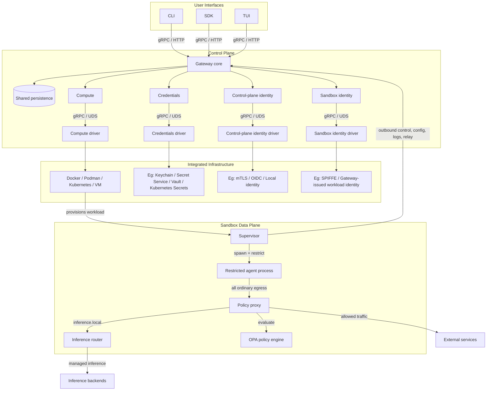

# OpenShell Architecture

OpenShell runs autonomous AI agents in sandboxed environments with explicit
policy, credential, identity, and network boundaries. The target architecture is
built around three stable runtime components: the **CLI**, the **Gateway**, and
the **Supervisor**.

The CLI, SDK, and TUI provide user-facing access. The gateway is the
authenticated control plane: it owns API access, durable state, policy and
settings delivery, provider and inference configuration, and relay
coordination. The supervisor runs inside every sandbox workload and is the local
security boundary. It launches the agent as a restricted child process and
enforces policy where process identity, filesystem access, network egress, and
runtime credentials are visible.

Infrastructure-specific work sits behind integration boundaries. Compute,
credentials, control-plane identity, and sandbox identity each have a driver or
adapter boundary so OpenShell can integrate with native runtimes, secret stores,
identity providers, and workload identity systems without moving those concerns
into the core gateway or sandbox model.

## Core Boundaries

| Component | Boundary |
|---|---|
| CLI, SDK, TUI | User-facing management surfaces. They talk to the gateway and do not need to know which infrastructure drivers are active. |
| Gateway | Authenticated control plane, API server, durable state, policy and settings delivery, provider and inference config, supervisor session ownership, and relay coordination. |
| Compute subsystem | Sandbox lifecycle semantics: creation, deletion, watching, reconciliation, and state transitions. Platform provisioning details belong to the compute driver. |
| Credentials subsystem | Logical provider and credential resolution. Secret storage and platform-native credential access belong to credentials drivers. |
| Control-plane identity | Authentication and authorization for users, operators, and API clients. External identity verification belongs to identity drivers. |
| Sandbox identity | Workload identity for supervisors and sandbox-to-sandbox authorization. Identity issuance or verification belongs to sandbox identity drivers. |
| Supervisor | Sandbox-local security boundary. It prepares isolation, fetches config, injects credentials, runs relay endpoints, starts the proxy, and launches restricted agent processes. |
| Policy proxy | Mandatory egress path for agent traffic. It enforces destination, binary identity, SSRF, TLS/L7, credential injection, and inference interception rules. |
| Inference router | Sandbox-local forwarding for `https://inference.local` to configured model backends. |

## Integrating with the Ecosystem

OpenShell should integrate with infrastructure ecosystems instead of replacing
them. The core value is safe, policy-enforced agent execution. Runtimes,
schedulers, secret stores, identity providers, workload identity systems, image
pipelines, storage, and GPU or device exposure should remain owned by the
platforms that already provide them.

The gateway owns OpenShell control-plane semantics: sandbox state, lifecycle
ordering, policy and settings resolution, credential mapping, authorization,
inference configuration, and relay coordination. Drivers translate those
semantics into platform-native operations. They should stay thin, preserve
native behavior by default, and report platform lifecycle events back through
the shared contracts.

The supervisor owns OpenShell sandbox semantics. Filesystem policy, process
privilege reduction, network proxying, inference interception, credential
injection, security logging, and gateway relay behavior should remain
consistent across runtimes.

This keeps OpenShell usable in local single-player setups, Kubernetes
deployments, VM-backed sandboxes, and future third-party environments. A new
integration should make OpenShell feel like a well-behaved member of that
ecosystem.

## Gateways and Sandboxes

The gateway and sandbox split control-plane authority from runtime enforcement.
The gateway owns durable platform state: sandboxes, policy revisions, runtime
settings, provider records, inference configuration, session records, and
authorization decisions. A sandbox owns the local execution boundary: process
identity, filesystem access, network egress, credential injection, local logs,
and the agent child process.

The relationship is supervisor initiated. Each sandbox supervisor connects
outbound to a known gateway endpoint, authenticates as a sandbox workload, and
keeps a live session open for control traffic and relays. This avoids requiring
every compute driver to solve gateway-to-sandbox reachability through pod IPs,
bridge networks, port mappings, NAT traversal, or bespoke tunnels. The common
runtime requirement is narrower: the supervisor must be able to reach the
gateway.

The gateway delivers desired state; the sandbox applies it locally. Policy,
settings, credentials, and inference routes flow from the gateway to the
supervisor. The supervisor validates and applies what can change at runtime,
keeps last-known-good config when refresh fails, and leaves static isolation
controls in place until the sandbox is recreated.

Live operations use the same authenticated gateway-supervisor relationship.
Config refresh, policy updates, credential delivery, log push, connect, exec,
file sync, and relay setup are multiplexed over supervisor sessions. If a
session drops, the sandbox may keep running, but live operations fail or become
unreachable until the supervisor reconnects and reconciles state.

## Architecture Docs

Architecture docs are short subsystem overviews. User-facing how-to content
lives in `docs/`. Implementation notes that only matter to one crate belong in
that crate's `README.md`.

| Document | Purpose |
|---|---|
| [Gateway](gateway.md) | Gateway control plane, auth, APIs, persistence, settings, and relay coordination. |
| [Sandbox](sandbox.md) | Sandbox supervisor, child process isolation, proxy, credentials, inference, connect, and logs. |
| [Security Policy](security-policy.md) | Policy model, enforcement layers, policy updates, policy advisor, and security logging. |
| [Compute Runtimes](compute-runtimes.md) | Docker, Podman, Kubernetes, VM, sandbox images, and runtime-specific responsibilities. |
| [Build](build.md) | Build artifacts, CI/E2E, docs site validation, and release packaging. |

## `rfc/` vs `architecture/`

For broad design proposals, use `rfc/`. Once an RFC is adopted, appropriate details should be written back to architecture docs.

`architecture/` serves as the canonical reference for OpenShell's design and architecture.

`rfc` serves to help facilitate discussion and ensure features are appropriately designed. These are useful for understanding the context in which certain architecture designs were made.
