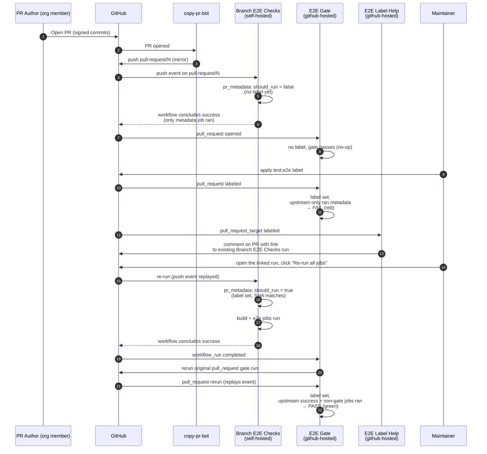
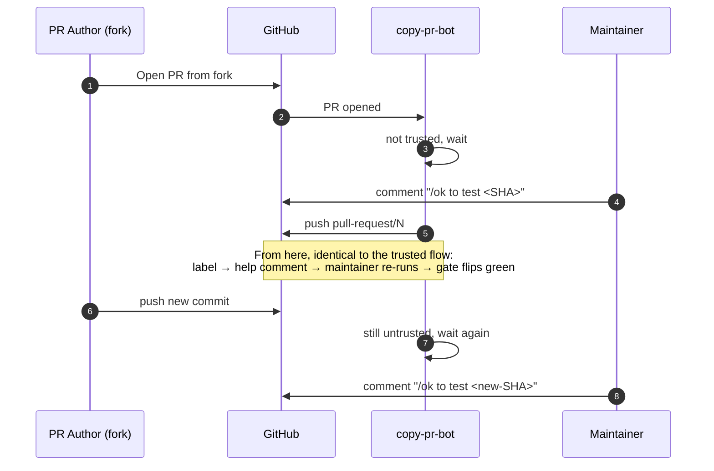

# E2E CI Architecture

This document describes the architecture of the E2E CI flow: every workflow involved, the trigger each one listens on, why those triggers were chosen, and how the pieces fit together. For the contributor-facing how-to (labels, signing, fork flow), see [CI.md](../CI.md).

## Goals and constraints

Three independent goals shape the design:

1. **Self-hosted runner safety.** Required PR checks, E2E, and GPU tests run on NVIDIA self-hosted runners. GitHub's [security hardening guide](https://docs.github.com/en/actions/security-guides/security-hardening-for-github-actions#hardening-for-self-hosted-runners) states bluntly: "Self-hosted runners should almost never be used for public repositories on GitHub, because any user can open pull requests against the repository and compromise the environment." Our workaround is the same one used elsewhere in NVIDIA's GHA infrastructure: copy-pr-bot mirrors trusted PRs into `pull-request/<N>` branches inside this repository, and the self-hosted workflows trigger on `push` to those mirror branches rather than on `pull_request`.
2. **Label as a hard merge gate.** When a PR carries `test:e2e` (or `test:e2e-gpu`), the corresponding suite *must* have actually executed and passed for the PR head SHA. The label has to be enforcing, not advisory: it blocks merge unless the suite ran with the label set.
3. **Per-job least privilege on the GitHub token.** Each workflow declares `permissions: {}` at the top, and each job declares only what it needs. This follows the hardening pattern described at <https://astral.sh/blog/open-source-security-at-astral>.

These three goals do not compose cleanly: the safety goal forces `push: pull-request/<N>` triggers (which the PR author can't influence), but `push` triggers don't fire on label changes, so the label gate has to come from a separate workflow on a different trigger. That is the heart of the architecture.

## Pieces at a glance

| File | Trigger | Role |
|---|---|---|
| `.github/copy-pr-bot.yaml` | (config) | Tells copy-pr-bot to mirror trusted PRs into `pull-request/<N>` branches. Pre-existed. |
| `.github/workflows/branch-checks.yml` | `push: pull-request/[0-9]+` + `workflow_dispatch` | Runs required branch checks on `linux-amd64-cpu8` and `linux-arm64-cpu8`. |
| `.github/workflows/branch-e2e.yml` | `push: pull-request/[0-9]+` + `workflow_dispatch` | Runs non-GPU E2E on `linux-arm64-cpu8`. |
| `.github/workflows/test-gpu.yml` | `push: pull-request/[0-9]+` + `workflow_dispatch` | Runs GPU E2E on self-hosted GPU runners. |
| `.github/actions/pr-gate/action.yml` | (composite) | Resolves PR metadata for a `pull-request/<N>` push and decides whether the run should proceed. Label enforcement is optional so ordinary branch checks can validate mirror metadata without introducing another PR label. |
| `.github/workflows/e2e-gate.yml` | `pull_request` + `workflow_run` | Posts the required `E2E Gate` check on the PR. Re-evaluates after the gated workflow completes. |
| `.github/workflows/e2e-gate-check.yml` | `workflow_call` | Reusable gate logic shared by E2E and GPU E2E. |
| `.github/workflows/e2e-label-help.yml` | `pull_request_target: [labeled]` | Posts a PR comment when a `test:e2e*` label is applied, telling the maintainer the next manual step (re-run an existing run, or `/ok to test <SHA>` to refresh the mirror). Does *not* dispatch the workflow itself - see "Why we don't auto-dispatch" below. |
| `.github/workflows/e2e-test.yml`, `e2e-gpu-test.yaml`, `docker-build.yml` | `workflow_call` | Reusable worker workflows. Unchanged by this design - called from the gated workflows and from release workflows. |

## OS-49 runner migration

OS-49 Phase 5 added non-required shadow workflows for the non-release workflows being prepared for shared-runner cutover. Phase 6 promoted the validated shared-runner path into the real non-release workflows and removed the obsolete PR-triggered shadow workflows to avoid duplicate PR checks.

`branch-checks.yml` uses `pr-gate` without a required label. That still verifies the mirror SHA matches the source PR head SHA, but does not require a new GitHub label for ordinary required checks. `branch-e2e.yml` keeps the existing `test:e2e` gate because it publishes temporary images and runs the expensive E2E suite. `ci-image.yml` now builds amd64 and arm64 CI images natively on shared CPU runners and merges the multi-arch manifest after both per-arch images are pushed.

## Trigger taxonomy

Five GitHub Actions trigger types appear in this flow. Each one was chosen for a specific reason - they are not interchangeable.

| Trigger | Workflow context | Token scope | Why we use it here |
|---|---|---|---|
| `push: pull-request/[0-9]+` | The pushed commit (mirror branch) | Repo-default | Only fires for branches copy-pr-bot created. Decouples test execution from PR author actions: the author cannot create a `pull-request/<N>` branch themselves. |
| `pull_request` | The PR head SHA, but actions checkout the *base* branch's workflow files | Read-only for forks | Lets us post a status check on the PR's head SHA (so branch protection sees it). Used by the `E2E Gate` evaluation jobs. |
| `pull_request_target` | Base branch | Write-capable, even for forks | Needed for `e2e-label-help.yml` to post a comment on a forked PR. The workflow never checks out PR code, so the standard `pull_request_target` foot-gun does not apply. |
| `workflow_run` | Default branch | Repo-default | Fires when the gated workflow finishes. Lets us run a gate re-evaluation step in a trusted (default-branch) context. |
| `workflow_dispatch` | Caller's ref | Repo-default | Maintainer-only manual re-run (clicking "Re-run all jobs" in the Actions UI). We deliberately do not call this from another workflow - see "Why we don't auto-dispatch" below. |

The non-obvious move here is that the same logical "did E2E pass for this PR" check has to be posted from two of these trigger contexts: a `pull_request`-triggered run (which can attach a check to the PR head SHA) and a `workflow_run`-triggered run (which knows the gated workflow finished but can only attach checks to `main`). The flow stitches them together by re-running the original `pull_request`-triggered run after the gated workflow completes.

## Happy-path flow (trusted PR, label applied after mirror)

The label-help workflow is intentionally a comment-only nudge: it never dispatches the workflow itself, so the maintainer's re-run goes through the same `push`-event run-id that originally fired on the mirror. This preserves in-progress visibility on the PR's Checks tab.

## Forked PR flow

The shape is identical but with two extra round trips: the maintainer has to vet each commit before copy-pr-bot will mirror it.

## Why each design choice exists

### Why `push` on `pull-request/<N>` instead of `pull_request`

`pull_request` workflows execute the workflow file from the PR's own branch. On a self-hosted runner, that means an attacker can rewrite our workflow YAML and run anything. `push: pull-request/<N>` only fires for branches that copy-pr-bot creates, so the workflow file source is always one that the bot vetted (signed commit + trusted author, or `/ok to test`).

### Why the gate has to verify a non-gate job actually ran

The gated workflows always start with a `pr_metadata` job. When the label is missing, `pr_metadata` reports `should_run=false` and the build/E2E jobs are skipped. From GitHub's perspective the workflow concluded `success`. If the gate only checked top-level conclusion, an unlabeled run from earlier would satisfy the gate forever - the label could be added without ever causing E2E to actually execute. The gate's "at least one non-gate job succeeded" check (`e2e-gate-check.yml:106-110`) is what forces a re-run after labeling.

### Why `workflow_run` is needed for the gate flip

Once the gated workflow runs and finishes, the `pull_request`-triggered gate check posted earlier still says "fail". `workflow_run` is the only event that fires when an arbitrary other workflow completes, and it's how we know to re-evaluate the gate. But `workflow_run` runs in the *default branch context*, so a check posted from there lands on `main` instead of the PR. Workaround: instead of posting a new check, look up the most recent `pull_request`-triggered gate run for the same head SHA and call `POST /actions/runs/<id>/rerun`. The re-run replays the original `pull_request` event, so the new check posts against the PR's head SHA and branch protection picks it up.

### Why `pull_request_target` for the label-help workflow

A `pull_request` workflow on a forked PR receives a read-only `GITHUB_TOKEN`. That's intentional: it prevents PR-supplied workflow code from escalating. But the help workflow doesn't *run* PR code - it never checks out the PR head, only the workflow file from `main`. It needs `pull-requests: write` to post a comment. `pull_request_target` provides a write-capable token while still loading the workflow definition from `main`. The standard `pull_request_target` warning ("don't check out PR code with this token") doesn't apply because we don't check out anything.

### Why we don't auto-dispatch the gated workflow

An earlier iteration of this design auto-dispatched the gated workflow via `gh workflow run --ref pull-request/<N>` from a `pull_request_target: [labeled]` workflow. It worked, but produced a worse UX: `workflow_dispatch`-triggered runs do not appear in the PR's Checks tab. The check-runs are technically attached to the PR head SHA (visible via `gh api commits/<sha>/check-runs`), but the PR UI filters them out because the run isn't associated with a PR-context event. The maintainer would see "Dispatched" comment, then no progress on the PR until the gate eventually flipped from red to green many minutes later.

We considered alternatives:

- **Push an empty marker commit to `pull-request/<N>` to fire a fresh `push` event.** Changes the SHA, breaks the gate's head-SHA equivalence, and writes to a branch copy-pr-bot owns. Architecturally bad.
- **Re-trigger copy-pr-bot programmatically.** copy-pr-bot only listens for `pull_request.*` and `issue_comment.created` events ([source](https://github.com/NVIDIA/gha-runners-apps/blob/main/packages/copy-pr-bot/src/app.ts)). Even commenting `/ok to test <SHA>` is a no-op when the mirror is already at that SHA - the bot calls `git.updateRef` with the same SHA and GitHub fires no new push event. There is no way to make copy-pr-bot re-fire a push without an actual SHA change.
- **Have the dispatcher post mirror Check Runs against the PR head SHA via the Checks API.** Possible, but adds a polling/webhook loop to keep the mirror checks in sync with the actual run. Not worth the complexity for a flow a maintainer goes through manually anyway.

The current design takes the pragmatic path: when a label is applied, the help workflow posts a comment with a deep link to the existing `Branch E2E Checks` run on the mirror. The maintainer clicks **Re-run all jobs**. That re-run replays the original `push` event, so its check-runs surface on the PR's Checks tab in real time. The cost is one human click per label application, in exchange for live progress visibility.

### Why labels and not comment commands

Labels persist as PR metadata and survive re-runs and force-pushes. Comment-based commands like `/ok to test` don't survive the same way: a comment from yesterday doesn't enable today's commit. Branch protection rules can require a check be present; they cannot require a comment. The label is the merge gate's primary signal because it is the only thing GitHub's branch protection knows how to look at.

## Permission posture

The gated E2E workflows declare `permissions: {}` at the top. Branch checks and CI image publishing use the minimum workflow/job grants needed for checkout, package pulls, and package pushes.

| Workflow | Job | Grants |
|---|---|---|
| `branch-checks.yml` | workflow default | `contents: read`, `packages: read` |
| | `pr_metadata` | `contents: read`, `pull-requests: read` |
| `ci-image.yml` | workflow default | `contents: read`, `packages: write` |
| `branch-e2e.yml`, `test-gpu.yml` | `pr_metadata` | `contents: read`, `pull-requests: read` |
| | `build-*` | `contents: read`, `packages: write` |
| | `e2e*` | `contents: read`, `packages: read` |
| `e2e-gate.yml` | `e2e`, `gpu` (`workflow_call`) | inherits via the called workflow |
| | `rerun-on-completion` | `actions: write` |
| `e2e-gate-check.yml` | `check` | `contents: read`, `pull-requests: read`, `actions: read` |
| `e2e-label-help.yml` | `hint` | `pull-requests: write`, `actions: read`, `contents: read` |

The reusable worker workflows (`e2e-test.yml`, `e2e-gpu-test.yaml`, `docker-build.yml`) declare their own internal permissions; the calling job grants are an upper bound for them.

Only one workflow holds an "interesting" token: `rerun-on-completion` in `e2e-gate.yml` has `actions: write`. It calls one specific endpoint - `POST /actions/runs/<id>/rerun` for an `e2e-gate.yml` run on the same head SHA - and never executes PR code. The label-help workflow holds only `pull-requests: write` for posting the comment, also without checking out PR code.

## Release flow

`release-tag.yml` and `release-dev.yml` call `e2e-test.yml` directly on `main` / tag pushes. Tags and `main` are inherently trusted refs, so they bypass copy-pr-bot. E2E still blocks the release jobs (`tag-ghcr-release: needs: [..., e2e]`).

Permissions on the release workflows are not yet scoped per-job. Tracked separately.

## Edge cases

| Case | What happens |
|---|---|
| Label applied before copy-pr-bot mirrors the PR | Help workflow detects no `pull-request/<N>` branch and posts a comment telling the maintainer to wait or run `/ok to test <SHA>`. |
| Label applied while mirror is stale (new commit pending `/ok to test`) | Help workflow detects mirror SHA != PR head SHA and posts the corresponding comment with the SHA the maintainer needs to vet. |
| Label removed | No reaction. The next PR event (push, label, etc.) re-evaluates the gate, which now sees no label and passes as a no-op. |
| Author force-pushes after label set | copy-pr-bot re-mirrors the new SHA → gated workflow fires on `push` → because the label is still on the PR, `pr_metadata` runs the build/E2E jobs without manual re-run → `workflow_run` fires the gate re-run → new green check on the new SHA. |
| Maintainer re-runs the gated workflow manually from the Actions UI | Same as above without the force-push. This is the path the help workflow points the maintainer at. |
| Gate's first evaluation fails (label set, upstream not yet started) | Email-on-failure noise. The check eventually flips to success once upstream finishes and `workflow_run` re-runs the gate. Tracked as a known rough edge; possible fix is posting `neutral` until the upstream completes. |

## References

- copy-pr-bot: <https://github.com/apps/copy-pr-bot>
- Astral hardening guidance: <https://astral.sh/blog/open-source-security-at-astral>
- GitHub Actions security pattern for self-hosted runners: <https://docs.github.com/en/actions/security-guides/security-hardening-for-github-actions>
- `pull_request_target` foot-gun: <https://securitylab.github.com/research/github-actions-preventing-pwn-requests/>
- Contributor-facing flow doc: [../CI.md](../CI.md)
