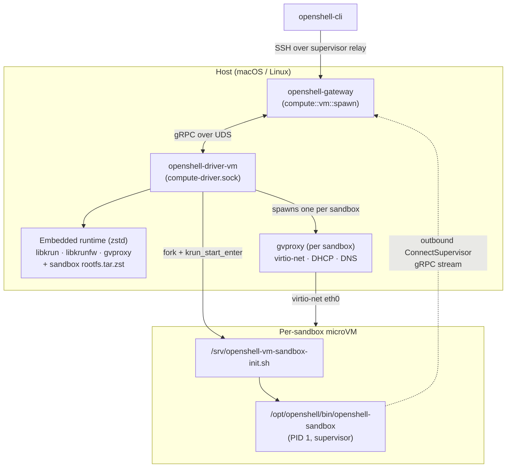
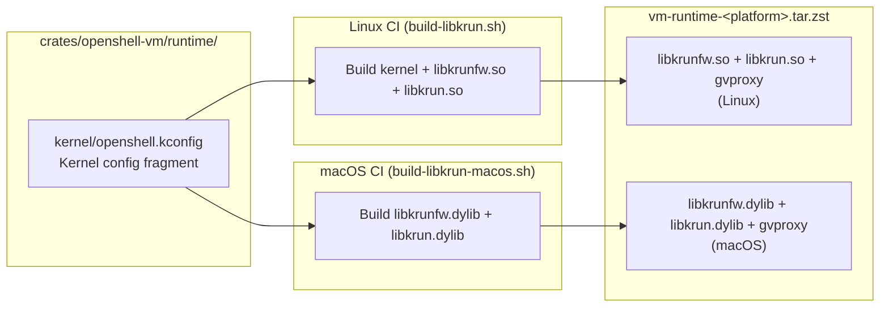

# Custom libkrunfw VM Runtime

> Status: Experimental and work in progress (WIP). The VM compute driver is
> under active development and may change.

## Overview

The OpenShell gateway uses [libkrun](https://github.com/containers/libkrun) via the
`openshell-driver-vm` compute driver to boot a lightweight microVM per sandbox.
Each VM runs on Apple Hypervisor.framework (macOS) or KVM (Linux), with the guest
kernel embedded inside `libkrunfw`.

The stock `libkrunfw` from Homebrew ships a minimal kernel without bridge,
netfilter, or conntrack support. That is insufficient for the sandbox supervisor's
per-sandbox network namespace primitives (veth pair + iptables, see
`crates/openshell-sandbox/src/sandbox/linux/netns.rs`). The custom libkrunfw
runtime adds bridge, iptables/nftables, and conntrack support to the guest
kernel.

The driver is spawned by `openshell-gateway` as a subprocess, talks to it over a
Unix domain socket (`compute-driver.sock`) with the
`openshell.compute.v1.ComputeDriver` gRPC surface, and manages per-sandbox
microVMs. The runtime (libkrun + libkrunfw + gvproxy) and the sandbox rootfs are
embedded directly in the driver binary — no sibling files required at runtime.

## Architecture



The driver spawns **one microVM per sandbox**. Each VM boots directly into
`openshell-sandbox` as PID 1. All gateway ingress — SSH, exec, connect — rides
the supervisor-initiated `ConnectSupervisor` gRPC stream opened from inside the
guest back out to the gateway, so gvproxy is configured with `-ssh-port -1` and
never binds a host-side TCP listener.

## Embedded Runtime

`openshell-driver-vm` embeds the VM runtime libraries and the sandbox rootfs as
zstd-compressed byte arrays, extracting on demand:

```
~/.local/share/openshell/vm-runtime/<version>/        # libkrun / libkrunfw / gvproxy
├── libkrun.{dylib,so}
├── libkrunfw.{5.dylib,so.5}
└── gvproxy

<state-dir>/sandboxes/<sandbox-id>/rootfs/            # per-sandbox rootfs
```

Old runtime cache versions are cleaned up when a new version is extracted.

### Sandbox rootfs preparation

The rootfs tarball the driver embeds starts from the same minimal Ubuntu base
used across the project, and is **rewritten into a supervisor-only sandbox
guest** during extraction:

- k3s state and Kubernetes manifests are stripped out
- `/srv/openshell-vm-sandbox-init.sh` is installed as the guest entrypoint
- the guest boots directly into `openshell-sandbox` — no k3s, no kube-proxy,
  no CNI plugins

See `crates/openshell-driver-vm/src/rootfs.rs` for the rewrite logic and
`crates/openshell-driver-vm/scripts/openshell-vm-sandbox-init.sh` for the init
script that gets installed.

### `--internal-run-vm` helper

The driver binary has two modes: the default mode is the gRPC server; when
launched with `--internal-run-vm` it becomes a per-sandbox launcher. The driver
spawns one launcher per sandbox as a subprocess, which in turn starts `gvproxy`
and calls `krun_start_enter` to boot the guest. Keeping the launcher in the
same binary means the driver ships a single artifact for both roles.

## Network Plane

The driver launches a **dedicated `gvproxy` instance per sandbox** to provide the
guest's networking plane:

- virtio-net backend over a Unix SOCK_STREAM (Linux) or SOCK_DGRAM (macOS vfkit)
  socket, which surfaces as `eth0` inside the guest
- DHCP server + default router (192.168.127.1 / 192.168.127.2) for the guest's
  udhcpc client
- DNS for host aliases: the guest init script seeds `/etc/hosts` with
  `host.openshell.internal` → 192.168.127.1, while leaving gvproxy's legacy
  `host.containers.internal` / `host.docker.internal` resolution intact

The `-listen` API socket and the `-ssh-port` forwarder are both intentionally
omitted. After the supervisor-initiated relay migration the driver does not
enqueue any host-side port forwards, and the guest's SSH listener lives on a
Unix socket at `/run/openshell/ssh.sock` inside the VM that is reached over the
outbound `ConnectSupervisor` gRPC stream. Binding a host listener would race
concurrent sandboxes for port 2222 and surface a misleading "sshd is reachable"
endpoint.

The sandbox supervisor's per-sandbox netns (veth pair + iptables) branches off
of this plane. libkrun's built-in TSI socket impersonation would not satisfy
those kernel-level primitives, which is why we need the custom libkrunfw.

## Process Lifecycle Cleanup

`openshell-driver-vm` installs a cross-platform "die when my parent dies"
primitive (`procguard`) in every link of the spawn chain so that killing
`openshell-gateway` (SIGTERM, SIGKILL, or crash) reaps the driver, per-sandbox
launcher, gvproxy, and the libkrun worker:

- Linux: `nix::sys::prctl::set_pdeathsig(SIGKILL)`
- macOS / BSDs: `smol-rs/polling` with `ProcessOps::Exit` on a helper thread
- gvproxy (the one non-Rust child) gets `PR_SET_PDEATHSIG` via `pre_exec` on
  Linux, and is SIGTERM'd from the launcher's procguard cleanup callback on
  macOS

See `crates/openshell-driver-vm/src/procguard.rs` for the implementation and
`tasks/scripts/vm/smoke-orphan-cleanup.sh` (exposed as
`mise run vm:smoke:orphan-cleanup`) for the regression test that covers both
SIGTERM and SIGKILL paths.

## Runtime Provenance

At driver startup the loaded runtime bundle is logged with:

- Library paths and SHA-256 hashes
- Whether the runtime is custom-built or stock
- For custom runtimes: libkrunfw commit, kernel version, build timestamp

This information is sourced from `provenance.json` (generated by the build
script) and makes it straightforward to correlate sandbox VM behavior with a
specific runtime artifact.

## Build Pipeline



The `vm-runtime-<platform>.tar.zst` artifact is consumed by
`openshell-driver-vm`'s `build.rs`, which embeds the library set into the
binary via `include_bytes!()`. Setting `OPENSHELL_VM_RUNTIME_COMPRESSED_DIR`
at build time (wired up by `crates/openshell-driver-vm/start.sh`) points the
build at the staged artifacts.

## Kernel Config Fragment

The `openshell.kconfig` fragment enables these kernel features on top of the
stock libkrunfw kernel:

| Feature | Key Configs | Purpose |
|---------|-------------|---------|
| Network namespaces | `CONFIG_NET_NS`, `CONFIG_NAMESPACES` | Sandbox netns isolation |
| veth | `CONFIG_VETH` | Sandbox network namespace pairs |
| Bridge device | `CONFIG_BRIDGE`, `CONFIG_BRIDGE_NETFILTER` | Bridge support + iptables visibility into bridge traffic |
| Netfilter framework | `CONFIG_NETFILTER`, `CONFIG_NETFILTER_ADVANCED`, `CONFIG_NETFILTER_XTABLES` | iptables/nftables framework |
| xtables match modules | `CONFIG_NETFILTER_XT_MATCH_CONNTRACK`, `_COMMENT`, `_MULTIPORT`, `_MARK`, `_STATISTIC`, `_ADDRTYPE`, `_RECENT`, `_LIMIT` | Sandbox supervisor iptables rules |
| Connection tracking | `CONFIG_NF_CONNTRACK`, `CONFIG_NF_CT_NETLINK` | NAT state tracking |
| NAT | `CONFIG_NF_NAT` | Sandbox egress DNAT/SNAT |
| iptables | `CONFIG_IP_NF_IPTABLES`, `CONFIG_IP_NF_FILTER`, `CONFIG_IP_NF_NAT`, `CONFIG_IP_NF_MANGLE` | Masquerade and compat |
| nftables | `CONFIG_NF_TABLES`, `CONFIG_NFT_CT`, `CONFIG_NFT_NAT`, `CONFIG_NFT_MASQ`, `CONFIG_NFT_NUMGEN`, `CONFIG_NFT_FIB_IPV4` | nftables path |
| IP forwarding | `CONFIG_IP_ADVANCED_ROUTER`, `CONFIG_IP_MULTIPLE_TABLES` | Sandbox-to-host routing |
| Traffic control | `CONFIG_NET_SCH_HTB`, `CONFIG_NET_CLS_CGROUP` | QoS |
| Cgroups | `CONFIG_CGROUPS`, `CONFIG_CGROUP_DEVICE`, `CONFIG_MEMCG`, `CONFIG_CGROUP_PIDS` | Sandbox resource limits |
| TUN/TAP | `CONFIG_TUN` | CNI plugin compatibility; inherited from the shared kconfig, not exercised by the driver. |
| Dummy interface | `CONFIG_DUMMY` | Fallback networking |
| Landlock | `CONFIG_SECURITY_LANDLOCK` | Sandbox supervisor filesystem sandboxing |
| Seccomp filter | `CONFIG_SECCOMP_FILTER` | Sandbox supervisor syscall filtering |

See `crates/openshell-vm/runtime/kernel/openshell.kconfig` for the full
fragment with inline comments explaining why each option is needed.

## Verification

- **Capability checker** (`check-vm-capabilities.sh`): runs inside a sandbox VM
  to verify kernel capabilities. Produces pass/fail results for each required
  feature.
- **Orphan-cleanup smoke test**: `mise run vm:smoke:orphan-cleanup` asserts
  that killing the gateway leaves zero driver, launcher, gvproxy, or libkrun
  survivors.

## Build Commands

```shell
# One-time setup: download pre-built runtime (~30s)
mise run vm:setup

# Start openshell-gateway with the VM compute driver
mise run gateway:vm

# With custom kernel (optional, adds ~20 min)
FROM_SOURCE=1 mise run vm:setup

# Wipe everything and start over
mise run vm:clean
```

See `crates/openshell-driver-vm/README.md` for the full driver workflow,
including multi-gateway development, CLI registration, and sandbox creation
examples.

## CI/CD

Two GitHub Actions workflows back the driver's release artifacts, both
publishing to a rolling `vm-dev` GitHub Release:

### Kernel Runtime (`release-vm-kernel.yml`)

Builds the custom libkrunfw (kernel firmware), libkrun (VMM), and gvproxy for
all supported platforms. Runs on-demand or when the kernel config / pinned
versions change.

| Platform | Runner | Build Method |
|----------|--------|-------------|
| Linux ARM64 | `build-arm64` (self-hosted) | Native `build-libkrun.sh` |
| Linux x86_64 | `build-amd64` (self-hosted) | Native `build-libkrun.sh` |
| macOS ARM64 | `macos-latest-xlarge` (GitHub-hosted) | `build-libkrun-macos.sh` |

Artifacts: `vm-runtime-{platform}.tar.zst` containing libkrun, libkrunfw,
gvproxy, and provenance metadata. Each platform builds its own libkrunfw and
libkrun natively; the kernel inside libkrunfw is always Linux regardless of
host platform.

### Driver Binary (`release-vm-dev.yml`)

Builds the self-contained `openshell-driver-vm` binary for every platform,
with the kernel runtime + sandbox rootfs embedded. Runs on every push to
`main` that touches VM-related crates.

The `download-kernel-runtime` job pulls the current `vm-runtime-<platform>.tar.zst`
from the `vm-dev` release; the `build-openshell-driver-vm` jobs set
`OPENSHELL_VM_RUNTIME_COMPRESSED_DIR=$PWD/target/vm-runtime-compressed` and
run `cargo build --release -p openshell-driver-vm`. The macOS driver is
cross-compiled via osxcross (no macOS runner needed for the binary build —
only for the kernel build).

macOS driver binaries produced via osxcross are not codesigned. Development
builds are signed automatically by `crates/openshell-driver-vm/start.sh`; a
packaged release needs signing in CI.

## Rollout Strategy

1. Custom runtime is embedded by default when building `openshell-driver-vm`
   with `OPENSHELL_VM_RUNTIME_COMPRESSED_DIR` set (wired up by
   `crates/openshell-driver-vm/start.sh`).
2. The sandbox init script validates kernel capabilities at boot and fails
   fast if missing.
3. For development, override with `OPENSHELL_VM_RUNTIME_DIR` to use a local
   directory instead of the extracted cache.
4. In CI, the kernel runtime is pre-built and cached in the `vm-dev` release.
   The driver build downloads it via `download-kernel-runtime.sh`.
