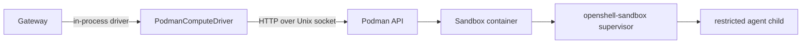

# openshell-driver-podman

Podman-backed compute driver for rootless and single-machine OpenShell
deployments.

The driver talks to the Podman libpod REST API over a Unix socket. It runs
in-process with the gateway server and creates one sandbox container per
sandbox. The `openshell-sandbox` supervisor inside the container still owns the
actual agent isolation.

## Runtime Model

The container is the runtime boundary. Inside it, the supervisor creates a
nested network namespace, starts the policy proxy, applies Landlock/seccomp, and
launches the agent child as an unprivileged user.

## Supervisor Delivery

Podman uses an OCI image volume to mount the supervisor binary read-only at
`/opt/openshell/bin`. The supervisor image is built from the `supervisor` target
in `deploy/docker/Dockerfile.images`.

This keeps the supervisor outside the mutable sandbox image while avoiding a
hostPath-style bind mount.

## Rootless Adaptations

Rootless Podman has stricter capability behavior than Kubernetes. The container
spec drops all capabilities and adds back only the supervisor capabilities it
needs:

- `SYS_ADMIN` for namespace and Landlock setup.
- `NET_ADMIN` for nested network namespace routing.
- `SYS_PTRACE` and `DAC_READ_SEARCH` for process identity inspection.
- `SYSLOG` for bypass diagnostics.
- `SETUID` and `SETGID` for dropping to the sandbox user.

The restricted agent child loses these privileges before user code runs.

## Network Model

The driver creates or reuses a Podman bridge network for container-to-host
communication. The agent child does not use that bridge directly. The supervisor
creates a nested namespace and routes agent egress through the local CONNECT
proxy.

`host.containers.internal` is used for callbacks to the host gateway. Rootless
networking may use pasta under the hood; avoid assumptions that require
container-to-container L2 reachability.

## Secrets and Environment

The SSH handshake secret is injected with Podman's `secret_env` API rather than
as a plain inspectable environment value. Sandbox identity, callback endpoint,
relay socket path, and command metadata are driver-controlled environment
variables and must override template values.

When TLS is configured, the driver mounts the client bundle read-only and sets
the standard `OPENSHELL_TLS_*` environment variables for the supervisor.

## GPU Support

GPU sandboxes use CDI device injection when `spec.gpu` is true and NVIDIA CDI
devices are available. The sandbox image must still include the user-space
libraries required by the workload.
