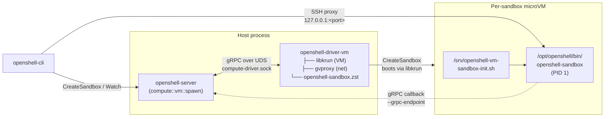

# openshell-driver-vm

> Status: Experimental. The VM compute driver is under active development and the interface still has VM-specific plumbing that will be generalized.

Standalone libkrun-backed [`ComputeDriver`](../../proto/compute_driver.proto) for OpenShell. The gateway spawns this binary as a subprocess, talks to it over a Unix domain socket with the `openshell.compute.v1.ComputeDriver` gRPC surface, and lets it manage per-sandbox microVMs. The runtime (libkrun + libkrunfw + gvproxy), guest OCI unpacker, and sandbox supervisor are embedded directly in the binary; each sandbox boots from a cached immutable bootstrap ext4 root disk plus a per-sandbox writable overlay disk. When the requested sandbox image differs from the bootstrap image, the driver prepares a read-only image ext4 disk inside a bootstrap VM and mounts that unpacked rootfs as the sandbox lowerdir.

## How it fits together



Sandbox guests execute `/opt/openshell/bin/openshell-sandbox` as PID 1 inside the VM. gvproxy exposes a single inbound SSH port (`host:<allocated>` → `guest:2222`) and provides virtio-net egress.

## Quick start (recommended)

```shell
mise run gateway:vm
```

First run takes a few minutes while `mise run vm:setup` stages libkrun/libkrunfw/gvproxy/umoci and `mise run vm:supervisor` builds the bundled guest supervisor. Subsequent runs are cached.

By default `mise run gateway:vm`:

- Listens on plaintext HTTP at `127.0.0.1:18081`.
- Registers the CLI gateway `vm-dev` by writing `~/.config/openshell/gateways/vm-dev/metadata.json`. It does not modify the workspace `.env`.
- Persists the gateway SQLite DB under `.cache/gateway-vm/gateway.db`.
- Places the VM driver state (per-sandbox `overlay.ext4`, image cache, and `run/compute-driver.sock`) under `/tmp/openshell-vm-driver-$USER-vm-dev/` so the AF_UNIX socket path stays under macOS `SUN_LEN`.
- Writes `.cache/gateway-vm/gateway.toml` with `[openshell.drivers.vm].driver_dir = "$PWD/target/debug"` so the freshly built `openshell-driver-vm` is used instead of an older installed copy from `~/.local/libexec/openshell`, `/usr/libexec/openshell`, or `/usr/local/libexec`.

For GPU passthrough (VFIO), pass `-- --gpu` and run with root privileges:

```shell
sudo -E env "PATH=$PATH" mise run gateway:vm -- --gpu
```

GPU passthrough uses VFIO and requires host support for IOMMU, root privileges
for bind/unbind operations, and a compatible sandbox image. The public GPU
overview lives in the repository `README.md`.

Point the CLI at the gateway with one of:

```shell
openshell --gateway vm-dev status
openshell gateway select vm-dev    # then plain `openshell <command>`
```

Override defaults via environment:

```shell
# custom port (fails fast if in use)
OPENSHELL_SERVER_PORT=18091 mise run gateway:vm

# custom CLI gateway name + namespace
OPENSHELL_VM_GATEWAY_NAME=vm-feature-a \
OPENSHELL_SANDBOX_NAMESPACE=vm-feature-a \
mise run gateway:vm

# custom sandbox image
OPENSHELL_SANDBOX_IMAGE=ghcr.io/example/sandbox:latest mise run gateway:vm

# custom bootstrap image for the VM runtime used to prepare/boot target images
OPENSHELL_VM_BOOTSTRAP_IMAGE=ghcr.io/example/bootstrap:latest mise run gateway:vm
```

Teardown:

```shell
rm -rf /tmp/openshell-vm-driver-$USER-vm-dev .cache/gateway-vm
rm -rf "${XDG_CONFIG_HOME:-$HOME/.config}/openshell/gateways/vm-dev"
```

## Manual equivalent

If you want to drive the launch yourself instead of using `mise run gateway:vm` (i.e. `tasks/scripts/gateway-vm.sh`):

```shell
# 1. Stage runtime artifacts + supervisor bundle into target/vm-runtime-compressed/
mise run vm:setup
mise run vm:supervisor          # if openshell-sandbox.zst is not already present

# 2. Build both binaries with the staged artifacts embedded
OPENSHELL_VM_RUNTIME_COMPRESSED_DIR=$PWD/target/vm-runtime-compressed \
  cargo build -p openshell-server -p openshell-driver-vm

# 3. macOS only: codesign the driver for Hypervisor.framework
codesign \
  --entitlements crates/openshell-driver-vm/entitlements.plist \
  --force -s - target/debug/openshell-driver-vm

# 4. Start the gateway with the VM driver
mkdir -p /tmp/openshell-vm-driver-$USER-vm-dev .cache/gateway-vm
cat > .cache/gateway-vm/gateway.toml <<EOF
[openshell]
version = 1

[openshell.gateway]
compute_drivers = ["vm"]
disable_tls = true

[openshell.drivers.vm]
default_image = "<compatible-image>"
grpc_endpoint = "http://host.containers.internal:18081"
driver_dir = "$PWD/target/debug"
state_dir = "/tmp/openshell-vm-driver-$USER-vm-dev"
EOF

target/debug/openshell-gateway \
  --config .cache/gateway-vm/gateway.toml \
  --drivers vm \
  --disable-tls \
  --db-url "sqlite:.cache/gateway-vm/gateway.db?mode=rwc" \
  --port 18081
```

The gateway resolves `openshell-driver-vm` in this order: `[openshell.drivers.vm].driver_dir`, conventional install locations (`~/.local/libexec/openshell`, `/usr/libexec/openshell`, `/usr/local/libexec/openshell`, `/usr/local/libexec`), then a sibling of the gateway binary.

## Gateway And Driver Configuration

Select the VM driver with `--drivers vm`, `OPENSHELL_DRIVERS=vm`, or `compute_drivers = ["vm"]` in `[openshell.gateway]`. Configure VM-specific settings in `[openshell.drivers.vm]`.

| Configuration key | Default | Purpose |
|---|---|---|
| `grpc_endpoint` | empty | Required. URL the sandbox guest dials to reach the gateway. Use `http://host.containers.internal:<port>` (or `host.docker.internal` / `host.openshell.internal`) so traffic flows through gvproxy's host-loopback NAT (HostIP `192.168.127.254` → host `127.0.0.1`). Loopback URLs like `http://127.0.0.1:<port>` are rewritten automatically by the driver. The bare gateway IP (`192.168.127.1`) only carries gvproxy's own services and will not reach host-bound ports. |
| `state_dir` | `target/openshell-vm-driver` | Per-sandbox overlay disks, console logs, image cache, and private `run/compute-driver.sock` UDS. |
| `driver_dir` | unset | Override the directory searched for `openshell-driver-vm`. |
| `default_image` | OpenShell base image | Sandbox image used when a create request omits one. |
| `bootstrap_image` | unset | VM runtime image used as the immutable bootstrap root disk. Defaults to the sandbox image when unset. |
| `vcpus` | `2` | vCPUs per sandbox. |
| `mem_mib` | `2048` | Memory per sandbox, in MiB. |
| `overlay_disk_mib` | `4096` | Sparse writable overlay disk size per sandbox, in MiB. |
| `krun_log_level` | `1` | libkrun verbosity (0-5). |
| `guest_tls_ca` | unset | CA cert for the guest's mTLS client bundle. Required when `grpc_endpoint` uses `https://`. |
| `guest_tls_cert` | unset | Guest client certificate. |
| `guest_tls_key` | unset | Guest client private key. |

See [`openshell-gateway --help`](../openshell-server/src/cli.rs) for the gateway process flag surface.

## Verifying the gateway

The gateway is auto-registered by `mise run gateway:vm`. In another terminal:

```shell
./scripts/bin/openshell status
./scripts/bin/openshell sandbox create --name demo --from <compatible-image>
./scripts/bin/openshell sandbox connect demo
```

First sandbox takes 10–30 seconds to boot (image fetch/prepare/cache + libkrun + guest init). If `--from` is omitted, the VM driver uses the gateway's configured default sandbox image. Without either `--from` or `--sandbox-image`, VM sandbox creation fails. Subsequent creates reuse the prepared image cache and create only a sparse per-sandbox `overlay.ext4` before boot.

`CreateSandbox` accepts the sandbox quickly and continues VM provisioning in the
background. The driver publishes platform events for image resolution, cache
hits/misses, layer pulls, rootfs preparation, overlay creation, and VM launcher
startup so the CLI can show progress through the existing sandbox watch stream.

The VM driver keeps two image caches. The bootstrap cache is a controlled
`rootfs.ext4` used to boot the guest init and OpenShell supervisor. The prepared
image cache is used when the requested sandbox image differs from the bootstrap
image: the host downloads registry layers into a valid OCI layout, attaches that
payload to a temporary bootstrap VM, and guest init runs `umoci raw unpack` onto
Linux-owned ext4 storage. The resulting disk is cached under
`<state-dir>/images/<cache-id>/rootfs.ext4` and attached read-only to later
sandboxes. Local Docker images are still exported as rootfs tar archives and
prepared inside the bootstrap VM. Set `OPENSHELL_VM_IMAGE_PULL_CONCURRENCY` to
tune registry layer download parallelism (default `4`, maximum `16`).

Each sandbox gets its own sparse writable
`<state-dir>/sandboxes/<id>/overlay.ext4`. Guest init mounts overlayfs as `/`
with the prepared image rootfs as lowerdir when present, otherwise the bootstrap
rootfs is used directly. Writes to `/sandbox` and other mutable paths land in
the overlay while cached image disks remain unchanged. The overlay disk must be
large enough to hold the compressed payload, unpacked rootfs, and sandbox writes
during the first prepare.

## Logs and debugging

Raise log verbosity for both processes:

```shell
RUST_LOG=openshell_server=debug,openshell_driver_vm=debug \
  mise run gateway:vm
```

The VM guest's serial console is appended to `<state-dir>/<sandbox-id>/console.log`. Sandbox IDs must match `[A-Za-z0-9._-]{1,128}` before the driver uses them in host paths. The gateway-owned compute-driver socket lives at `<state-dir>/run/compute-driver.sock`; OpenShell creates `run/` with owner-only permissions, removes same-owner stale sockets, and the gateway removes the socket on clean shutdown via `ManagedDriverProcess::drop`. UDS clients must match the driver UID and provide the expected gateway process PID by default. Standalone same-UID UDS mode requires the explicit `--allow-same-uid-peer` development flag. TCP mode is disabled by default because it is unauthenticated; use `--allow-unauthenticated-tcp --bind-address 127.0.0.1:50061` only for local development.

## Prerequisites

- macOS on Apple Silicon, or Linux on aarch64/x86_64 with KVM
- Rust toolchain
- e2fsprogs (`mke2fs` or `mkfs.ext4`, plus `debugfs`) for root and overlay disk image creation and QEMU environment injection
- Guest-supervisor cross-compile toolchain (needed on macOS, and on Linux when host arch ≠ guest arch):
  - Matching rustup target: `rustup target add aarch64-unknown-linux-gnu` (or `x86_64-unknown-linux-gnu` for an amd64 guest)
  - `cargo install --locked cargo-zigbuild` and `brew install zig` (or distro equivalent). `vm:supervisor` uses `cargo zigbuild` to cross-compile the in-VM `openshell-sandbox` supervisor binary.
- [mise](https://mise.jdx.dev/) task runner
- Docker or Podman socket on the local CLI/gateway host when using
  `openshell sandbox create --from ./Dockerfile` or `--from ./dir`; the CLI
  builds the image and the VM driver exports it via the local container engine.
  Docker is tried first; if unavailable, the driver falls back to the Podman
  socket. On Linux, enable the Podman API socket with
  `systemctl --user start podman.socket`
- `gh` CLI (used by `mise run vm:setup` to download pre-built runtime artifacts)

## Releases

`openshell-driver-vm` is published as a normal OpenShell release artifact:

- development builds: the rolling `dev` release
- tagged builds: the corresponding `v*` release
- runtime tarballs: the rolling `vm-runtime` release, rebuilt on demand by
  `release-vm-kernel.yml`

On Debian-family Linux amd64 and arm64 systems, `install.sh` installs the
Debian package from the selected `OPENSHELL_VERSION` release tag. That package
includes `openshell-gateway` and `openshell-driver-vm`, but leaves
`OPENSHELL_DRIVERS` unset so the gateway uses its normal runtime
auto-detection. Set `OPENSHELL_DRIVERS=vm` to force the VM driver.

On RPM-family Linux x86_64 and aarch64 systems, `install.sh` installs the
`openshell` and `openshell-gateway` RPM packages from the selected release tag.
The RPM gateway package is configured for the Podman driver.

On Apple Silicon macOS, `install.sh` stages the generated `openshell.rb`
formula from the selected release in the `nvidia/openshell` Homebrew tap.
Homebrew installs `openshell`, `openshell-gateway`, and
`openshell-driver-vm`, ad-hoc signs the driver with the Hypervisor entitlement
in `post_install`, and owns the `brew services` gateway lifecycle. The service
also leaves `OPENSHELL_DRIVERS` unset so driver choice remains automatic unless
the user explicitly overrides it.

## TODOs

- The gateway still configures the driver via CLI args; this will move to a gRPC bootstrap call so the driver interface is uniform across backends. See the `TODO(driver-abstraction)` notes in `crates/openshell-server/src/lib.rs` and `crates/openshell-server/src/compute/vm.rs`.
- macOS local builds are codesigned by `tasks/scripts/gateway-vm.sh`; the generated Homebrew formula signs the release tarball driver for local installs.
