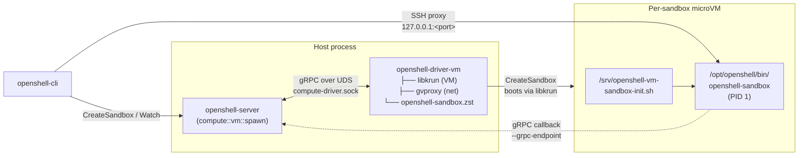

# openshell-driver-vm

> Status: Experimental. The VM compute driver is under active development and the interface still has VM-specific plumbing that will be generalized.

Standalone libkrun-backed [`ComputeDriver`](../../proto/compute_driver.proto) for OpenShell. The gateway spawns this binary as a subprocess, talks to it over a Unix domain socket with the `openshell.compute.v1.ComputeDriver` gRPC surface, and lets it manage per-sandbox microVMs. The runtime (libkrun + libkrunfw + gvproxy) and the sandbox supervisor are embedded directly in the binary; each sandbox guest rootfs is derived from a configured container image at create time.

## How it fits together



Sandbox guests execute `/opt/openshell/bin/openshell-sandbox` as PID 1 inside the VM. gvproxy exposes a single inbound SSH port (`host:<allocated>` → `guest:2222`) and provides virtio-net egress.

## Quick start (recommended)

```shell
mise run gateway:vm
```

First run takes a few minutes while `mise run vm:setup` stages libkrun/libkrunfw/gvproxy and `mise run vm:supervisor` builds the bundled guest supervisor. Subsequent runs are cached.

By default `mise run gateway:vm`:

- Listens on plaintext HTTP at `127.0.0.1:18081`.
- Registers the CLI gateway `vm-dev` by writing `~/.config/openshell/gateways/vm-dev/metadata.json`. It does not modify the workspace `.env`.
- Persists the gateway SQLite DB under `.cache/gateway-vm/gateway.db`.
- Places the VM driver state (per-sandbox rootfs + `compute-driver.sock`) under `/tmp/openshell-vm-driver-$USER-vm-dev/` so the AF_UNIX socket path stays under macOS `SUN_LEN`.
- Passes `--driver-dir $PWD/target/debug` so the freshly built `openshell-driver-vm` is used instead of an older installed copy from `~/.local/libexec/openshell`, `/usr/libexec/openshell`, or `/usr/local/libexec`.

For GPU passthrough (VFIO), pass `-- --gpu` and run with root privileges:

```shell
sudo -E env "PATH=$PATH" mise run gateway:vm -- --gpu
```

See [`architecture/vm-gpu-sandbox-guide.md`](../../architecture/vm-gpu-sandbox-guide.md) for full GPU prerequisites and usage.

Point the CLI at the gateway with one of:

```shell
openshell --gateway vm-dev status
openshell gateway select vm-dev    # then plain `openshell <command>`
```

Override defaults via environment:

```shell
# custom port (fails fast if in use)
OPENSHELL_SERVER_PORT=18091 mise run gateway:vm

# custom CLI gateway name + namespace
OPENSHELL_VM_GATEWAY_NAME=vm-feature-a \
OPENSHELL_SANDBOX_NAMESPACE=vm-feature-a \
mise run gateway:vm

# custom sandbox image
OPENSHELL_SANDBOX_IMAGE=ghcr.io/example/sandbox:latest mise run gateway:vm
```

Teardown:

```shell
rm -rf /tmp/openshell-vm-driver-$USER-vm-dev .cache/gateway-vm
rm -rf "${XDG_CONFIG_HOME:-$HOME/.config}/openshell/gateways/vm-dev"
```

## Manual equivalent

If you want to drive the launch yourself instead of using `mise run gateway:vm` (i.e. `tasks/scripts/gateway-vm.sh`):

```shell
# 1. Stage runtime artifacts + supervisor bundle into target/vm-runtime-compressed/
mise run vm:setup
mise run vm:supervisor          # if openshell-sandbox.zst is not already present

# 2. Build both binaries with the staged artifacts embedded
OPENSHELL_VM_RUNTIME_COMPRESSED_DIR=$PWD/target/vm-runtime-compressed \
  cargo build -p openshell-server -p openshell-driver-vm

# 3. macOS only: codesign the driver for Hypervisor.framework
codesign \
  --entitlements crates/openshell-driver-vm/entitlements.plist \
  --force -s - target/debug/openshell-driver-vm

# 4. Start the gateway with the VM driver
mkdir -p /tmp/openshell-vm-driver-$USER-vm-dev .cache/gateway-vm
target/debug/openshell-gateway \
  --drivers vm \
  --disable-tls \
  --db-url "sqlite:.cache/gateway-vm/gateway.db?mode=rwc" \
  --driver-dir $PWD/target/debug \
  --sandbox-namespace vm-dev \
  --sandbox-image <compatible-image> \
  --grpc-endpoint http://host.containers.internal:18081 \
  --port 18081 \
  --vm-driver-state-dir /tmp/openshell-vm-driver-$USER-vm-dev
```

The gateway resolves `openshell-driver-vm` in this order: `--driver-dir`, conventional install locations (`~/.local/libexec/openshell`, `/usr/libexec/openshell`, `/usr/local/libexec/openshell`, `/usr/local/libexec`), then a sibling of the gateway binary.

## Flags

| Flag | Env var | Default | Purpose |
|---|---|---|---|
| `--drivers vm` | `OPENSHELL_DRIVERS` | `kubernetes` | Select the VM compute driver. |
| `--grpc-endpoint URL` | `OPENSHELL_GRPC_ENDPOINT` | — | Required. URL the sandbox guest dials to reach the gateway. Use `http://host.containers.internal:<port>` (or `host.docker.internal` / `host.openshell.internal`) so traffic flows through gvproxy's host-loopback NAT (HostIP `192.168.127.254` → host `127.0.0.1`). Loopback URLs like `http://127.0.0.1:<port>` are rewritten automatically by the driver. The bare gateway IP (`192.168.127.1`) only carries gvproxy's own services and will not reach host-bound ports. |
| `--vm-driver-state-dir DIR` | `OPENSHELL_VM_DRIVER_STATE_DIR` | `target/openshell-vm-driver` | Per-sandbox rootfs, console logs, and the `compute-driver.sock` UDS. |
| `--driver-dir DIR` | `OPENSHELL_DRIVER_DIR` | unset | Override the directory searched for `openshell-driver-vm`. |
| `--vm-driver-vcpus N` | `OPENSHELL_VM_DRIVER_VCPUS` | `2` | vCPUs per sandbox. |
| `--vm-driver-mem-mib N` | `OPENSHELL_VM_DRIVER_MEM_MIB` | `2048` | Memory per sandbox, in MiB. |
| `--vm-krun-log-level N` | `OPENSHELL_VM_KRUN_LOG_LEVEL` | `1` | libkrun verbosity (0–5). |
| `--vm-tls-ca PATH` | `OPENSHELL_VM_TLS_CA` | — | CA cert for the guest's mTLS client bundle. Required when `--grpc-endpoint` uses `https://`. |
| `--vm-tls-cert PATH` | `OPENSHELL_VM_TLS_CERT` | — | Guest client certificate. |
| `--vm-tls-key PATH` | `OPENSHELL_VM_TLS_KEY` | — | Guest client private key. |

See [`openshell-gateway --help`](../openshell-server/src/cli.rs) for the full flag surface shared with the Kubernetes driver.

## Verifying the gateway

The gateway is auto-registered by `mise run gateway:vm`. In another terminal:

```shell
./scripts/bin/openshell status
./scripts/bin/openshell sandbox create --name demo --from <compatible-image>
./scripts/bin/openshell sandbox connect demo
```

First sandbox takes 10–30 seconds to boot (image fetch/prepare/cache + libkrun + guest init). If `--from` is omitted, the VM driver uses the gateway's configured default sandbox image. Without either `--from` or `--sandbox-image`, VM sandbox creation fails. Subsequent creates reuse the prepared sandbox rootfs.

## Logs and debugging

Raise log verbosity for both processes:

```shell
RUST_LOG=openshell_server=debug,openshell_driver_vm=debug \
  mise run gateway:vm
```

The VM guest's serial console is appended to `<state-dir>/<sandbox-id>/console.log`. The `compute-driver.sock` lives at `<state-dir>/compute-driver.sock`; the gateway removes it on clean shutdown via `ManagedDriverProcess::drop`.

## Prerequisites

- macOS on Apple Silicon, or Linux on aarch64/x86_64 with KVM
- Rust toolchain
- Guest-supervisor cross-compile toolchain (needed on macOS, and on Linux when host arch ≠ guest arch):
  - Matching rustup target: `rustup target add aarch64-unknown-linux-gnu` (or `x86_64-unknown-linux-gnu` for an amd64 guest)
  - `cargo install --locked cargo-zigbuild` and `brew install zig` (or distro equivalent). `vm:supervisor` uses `cargo zigbuild` to cross-compile the in-VM `openshell-sandbox` supervisor binary.
- [mise](https://mise.jdx.dev/) task runner
- Docker-compatible socket on the local CLI/gateway host when using
  `openshell sandbox create --from ./Dockerfile` or `--from ./dir`; the CLI
  builds the image and the VM driver exports it via the local Docker daemon
- `gh` CLI (used by `mise run vm:setup` to download pre-built runtime artifacts)

## Relationship to `openshell-vm`

`openshell-vm` is a separate, legacy crate that runs the **whole OpenShell gateway inside a single VM**. `openshell-driver-vm` is the compute driver called by a host-resident gateway to spawn **per-sandbox VMs**. Both embed libkrun but share no Rust code — the driver vendors its own rootfs handling and runtime loader so `openshell-server` never has to link libkrun.

## TODOs

- The gateway still configures the driver via CLI args; this will move to a gRPC bootstrap call so the driver interface is uniform across backends. See the `TODO(driver-abstraction)` notes in `crates/openshell-server/src/lib.rs` and `crates/openshell-server/src/compute/vm.rs`.
- macOS codesigning is handled by `tasks/scripts/gateway-vm.sh`; a packaged release would need signing in CI.
