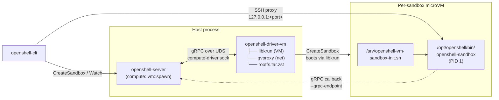

# openshell-driver-vm

> Status: Experimental. The VM compute driver is under active development and the interface still has VM-specific plumbing that will be generalized.

Standalone libkrun-backed [`ComputeDriver`](../../proto/compute_driver.proto) for OpenShell. The gateway spawns this binary as a subprocess, talks to it over a Unix domain socket with the `openshell.compute.v1.ComputeDriver` gRPC surface, and lets it manage per-sandbox microVMs. The runtime (libkrun + libkrunfw + gvproxy) and sandbox rootfs are embedded directly in the binary — no sibling files required at runtime.

## How it fits together



Sandbox guests execute `/opt/openshell/bin/openshell-sandbox` as PID 1 inside the VM. gvproxy exposes a single inbound SSH port (`host:<allocated>` → `guest:2222`) and provides virtio-net egress.

## Quick start (recommended)

```shell
mise run gateway:vm
```

First run takes a few minutes while `mise run vm:setup` stages libkrun/libkrunfw/gvproxy and `mise run vm:rootfs -- --base` builds the embedded rootfs. Subsequent runs are cached. To keep the Unix socket path under macOS `SUN_LEN`, `mise run gateway:vm` and `start.sh` default the state dir to `/tmp/openshell-vm-driver-dev-$USER-port-$PORT/` (SQLite DB + per-sandbox rootfs + `compute-driver.sock`) unless `OPENSHELL_VM_DRIVER_STATE_DIR` is set.
The wrapper also prints the recommended gateway name (`vm-driver-port-$PORT` by default) plus the exact repo-local `scripts/bin/openshell gateway add` and `scripts/bin/openshell gateway select` commands to use from another terminal. This avoids accidentally hitting an older `openshell` binary elsewhere on your `PATH`.
It also exports `OPENSHELL_DRIVER_DIR=$PWD/target/debug` before starting the gateway so local dev runs use the freshly built `openshell-driver-vm` instead of an older installed copy from `~/.local/libexec/openshell` or `/usr/local/libexec`.

Override via environment:

```shell
OPENSHELL_SERVER_PORT=9090 \
OPENSHELL_SSH_HANDSHAKE_SECRET=$(openssl rand -hex 32) \
crates/openshell-driver-vm/start.sh
```

Run multiple dev gateways side by side by giving each one a unique port. The wrapper derives a distinct default state dir from that port automatically:

```shell
OPENSHELL_SERVER_PORT=8080 mise run gateway:vm
OPENSHELL_SERVER_PORT=8081 mise run gateway:vm
```

If you want a custom suffix instead of `port-$PORT`, set `OPENSHELL_VM_INSTANCE`:

```shell
OPENSHELL_SERVER_PORT=8082 \
OPENSHELL_VM_INSTANCE=feature-a \
mise run gateway:vm
```

If you want a custom CLI gateway name, set `OPENSHELL_VM_GATEWAY_NAME`:

```shell
OPENSHELL_SERVER_PORT=8082 \
OPENSHELL_VM_GATEWAY_NAME=vm-feature-a \
mise run gateway:vm
```

Teardown:

```shell
rm -rf /tmp/openshell-vm-driver-dev-$USER-port-8080
```

## Manual equivalent

If you want to drive the launch yourself instead of using `start.sh`:

```shell
# 1. Stage runtime artifacts + base rootfs into target/vm-runtime-compressed/
mise run vm:setup
mise run vm:rootfs -- --base    # if rootfs.tar.zst is not already present

# 2. Build both binaries with the staged artifacts embedded
OPENSHELL_VM_RUNTIME_COMPRESSED_DIR=$PWD/target/vm-runtime-compressed \
  cargo build -p openshell-server -p openshell-driver-vm

# 3. macOS only: codesign the driver for Hypervisor.framework
codesign \
  --entitlements crates/openshell-driver-vm/entitlements.plist \
  --force -s - target/debug/openshell-driver-vm

# 4. Start the gateway with the VM driver
mkdir -p /tmp/openshell-vm-driver-dev-$USER-port-8080
target/debug/openshell-gateway \
  --drivers vm \
  --disable-tls \
  --database-url sqlite:/tmp/openshell-vm-driver-dev-$USER-port-8080/openshell.db \
  --driver-dir $PWD/target/debug \
  --grpc-endpoint http://host.containers.internal:8080 \
  --ssh-handshake-secret dev-vm-driver-secret \
  --ssh-gateway-host 127.0.0.1 \
  --ssh-gateway-port 8080 \
  --vm-driver-state-dir /tmp/openshell-vm-driver-dev-$USER-port-8080
```

The gateway resolves `openshell-driver-vm` in this order: `--driver-dir`, conventional install locations (`~/.local/libexec/openshell`, `/usr/local/libexec/openshell`, `/usr/local/libexec`), then a sibling of the gateway binary.

## Flags

| Flag | Env var | Default | Purpose |
|---|---|---|---|
| `--drivers vm` | `OPENSHELL_DRIVERS` | `kubernetes` | Select the VM compute driver. |
| `--grpc-endpoint URL` | `OPENSHELL_GRPC_ENDPOINT` | — | Required. URL the sandbox guest calls back to. Use a host alias that resolves to the gateway's host from inside the VM (`host.containers.internal` comes from gvproxy DNS; the guest init script also seeds `host.openshell.internal` to `192.168.127.1`). |
| `--vm-driver-state-dir DIR` | `OPENSHELL_VM_DRIVER_STATE_DIR` | `target/openshell-vm-driver` | Per-sandbox rootfs, console logs, and the `compute-driver.sock` UDS. |
| `--driver-dir DIR` | `OPENSHELL_DRIVER_DIR` | unset | Override the directory searched for `openshell-driver-vm`. |
| `--vm-driver-vcpus N` | `OPENSHELL_VM_DRIVER_VCPUS` | `2` | vCPUs per sandbox. |
| `--vm-driver-mem-mib N` | `OPENSHELL_VM_DRIVER_MEM_MIB` | `2048` | Memory per sandbox, in MiB. |
| `--vm-krun-log-level N` | `OPENSHELL_VM_KRUN_LOG_LEVEL` | `1` | libkrun verbosity (0–5). |
| `--vm-tls-ca PATH` | `OPENSHELL_VM_TLS_CA` | — | CA cert for the guest's mTLS client bundle. Required when `--grpc-endpoint` uses `https://`. |
| `--vm-tls-cert PATH` | `OPENSHELL_VM_TLS_CERT` | — | Guest client certificate. |
| `--vm-tls-key PATH` | `OPENSHELL_VM_TLS_KEY` | — | Guest client private key. |

See [`openshell-gateway --help`](../openshell-server/src/cli.rs) for the full flag surface shared with the Kubernetes driver.

## Verifying the gateway

In another terminal:

```shell
export OPENSHELL_GATEWAY_URL=http://127.0.0.1:8080
cargo run -p openshell-cli -- gateway register local --url $OPENSHELL_GATEWAY_URL --no-tls
cargo run -p openshell-cli -- sandbox create --name demo
cargo run -p openshell-cli -- sandbox connect demo
```

First sandbox takes 10–30 seconds to boot (rootfs extraction + libkrun + guest init). Subsequent creates reuse the prepared sandbox rootfs.

## Logs and debugging

Raise log verbosity for both processes:

```shell
RUST_LOG=openshell_server=debug,openshell_driver_vm=debug \
  crates/openshell-driver-vm/start.sh
```

The VM guest's serial console is appended to `<state-dir>/<sandbox-id>/console.log`. The `compute-driver.sock` lives at `<state-dir>/compute-driver.sock`; the gateway removes it on clean shutdown via `ManagedDriverProcess::drop`.

## Prerequisites

- macOS on Apple Silicon, or Linux on aarch64/x86_64 with KVM
- Rust toolchain
- Guest-supervisor cross-compile toolchain (needed on macOS, and on Linux when host arch ≠ guest arch):
  - Matching rustup target: `rustup target add aarch64-unknown-linux-gnu` (or `x86_64-unknown-linux-gnu` for an amd64 guest)
  - `cargo install --locked cargo-zigbuild` and `brew install zig` (or distro equivalent). `build-rootfs.sh` uses `cargo zigbuild` to cross-compile the in-VM `openshell-sandbox` supervisor binary.
- [mise](https://mise.jdx.dev/) task runner
- Docker (needed by `mise run vm:rootfs` to build the base rootfs)
- `gh` CLI (used by `mise run vm:setup` to download pre-built runtime artifacts)

## Relationship to `openshell-vm`

`openshell-vm` is a separate, legacy crate that runs the **whole OpenShell gateway inside a single VM**. `openshell-driver-vm` is the compute driver called by a host-resident gateway to spawn **per-sandbox VMs**. Both embed libkrun but share no Rust code — the driver vendors its own rootfs handling and runtime loader so `openshell-server` never has to link libkrun.

## TODOs

- The gateway still configures the driver via CLI args; this will move to a gRPC bootstrap call so the driver interface is uniform across backends. See the `TODO(driver-abstraction)` notes in `crates/openshell-server/src/lib.rs` and `crates/openshell-server/src/compute/vm.rs`.
- macOS codesigning is handled by `start.sh`; a packaged release would need signing in CI.
