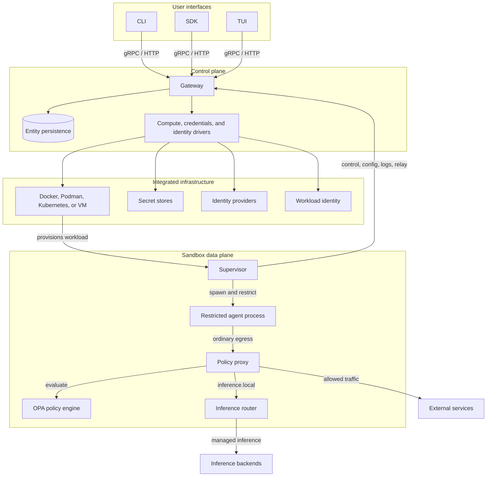

OpenShell is built around three stable runtime components: the **CLI**, the **Gateway**, and the **Supervisor**.

The CLI, SDK, and TUI provide user-facing access. The gateway is the
control plane: it owns API access, state, policy and settings delivery, provider and inference configuration, and relay coordination. The supervisor runs inside every sandbox workload and is the local security boundary. It launches the agent as a restricted child process and enforces policy where process identity, filesystem access, network egress, and
runtime credentials are visible.

Infrastructure-specific work sits behind integration boundaries. Compute,
credentials, control-plane identity, and sandbox identity each have a driver or
adapter boundary so OpenShell can integrate with native runtimes, secret stores,
identity providers, and workload identity systems without moving those concerns
into the core gateway or sandbox model.

## Deployment Models

OpenShell can run on a single local machine or in a remote Kubernetes cluster.
The CLI workflow stays the same: users point the CLI, SDK, or TUI at a gateway,
and the gateway provisions sandboxes through its configured compute driver.

| Deployment | How it works | Best for |
|---|---|---|
| Local machine | The gateway runs on the user's workstation or a nearby development host and creates sandboxes with Docker, Podman, or a VM runtime. The supervisor inside each sandbox connects back to that local gateway. | Individual development, local agent experiments, and private workstation workflows. |
| Remote Kubernetes cluster | The gateway runs as a cluster service and creates sandbox pods in the configured namespace. Supervisors connect outbound to the gateway endpoint, so clients do not need direct pod access. | Shared teams, centrally managed policy, remote compute, GPUs, and production-like environments. |

This deployment split keeps the runtime model consistent. Local deployments use
the host's container or VM runtime as the integrated infrastructure. Kubernetes
deployments use the cluster scheduler, networking, secrets, identity, and GPU
device plugins without changing the gateway and sandbox contract.

## Core Components

| Component | Boundary |
|---|---|
| [Sandboxes](/sandboxes/manage-sandboxes) | Data-plane workloads that run the supervisor, launch restricted agent processes, apply local isolation, push logs, and maintain the gateway session. |
| [Gateways](/sandboxes/manage-gateways) | Authenticated control plane that owns API access, durable state, sandbox lifecycle, settings delivery, authorization, and relay coordination. |
| [Providers](/sandboxes/manage-providers) | Credential and provider records that map logical agent needs to platform or user-managed secrets without exposing raw credentials to the agent process. |
| [Policies](/sandboxes/policies) | Declarative controls for filesystem access, process identity, network egress, L7 rules, credential injection, and runtime policy updates. |
| [Inference Routing](/sandboxes/inference-routing) | Managed `https://inference.local` path that routes model traffic to configured backends while keeping provider credentials outside the sandbox. |

## Gateways and Sandboxes

The gateway and sandbox split control-plane authority from runtime enforcement. The gateway owns durable platform state: sandboxes, policy revisions, runtime settings, provider records, inference configuration, session records, and authorization decisions. A sandbox owns the local execution boundary: process identity, filesystem access, network egress, credential injection, local logs, and the agent child process.

The relationship is supervisor initiated. Each sandbox supervisor connects outbound to a known gateway endpoint, authenticates as a sandbox workload, and keeps a live session open for control traffic and relays. This avoids requiring every compute driver to solve gateway-to-sandbox reachability through pod IPs, bridge networks, port mappings, NAT traversal, or custom tunnels.

The gateway delivers desired state. The supervisor applies it locally, keeps last-known-good config when refresh fails, and leaves static isolation controls in place until the sandbox is recreated. Live operations such as config refresh, policy updates, credential delivery, log push, connect, exec, file sync, and relay setup use the same authenticated gateway-supervisor relationship.

## Supervisor Protection Layers

The supervisor is the sandbox-local enforcement component. It starts before the
agent process, prepares the sandbox runtime, fetches gateway configuration, and
then launches the agent under the active policy.

| Protection layer | Supervisor responsibility |
|---|---|
| Process | Drops privileges, applies process identity rules, disables privilege escalation paths, and starts the agent as a restricted child process. |
| Filesystem | Applies filesystem policy before the agent starts so undeclared paths are inaccessible and declared paths are read-only or read-write as configured. |
| Network | Routes ordinary egress through the policy proxy so destination, port, binary identity, and L7 request rules can be evaluated before traffic leaves the sandbox. |
| Credentials | Receives credential material from the gateway and injects it only through configured policy paths or request-time proxy rules. |
| Inference | Intercepts `https://inference.local` and forwards model traffic through the configured inference route instead of exposing provider credentials to the agent. |
| Observability | Emits local security and lifecycle logs, pushes sandbox logs to the gateway, and keeps relay endpoints available for connect, exec, and file transfer operations. |

Static controls such as filesystem and process isolation are established at
sandbox start and require sandbox recreation to change. Dynamic controls such as
network policy, credential delivery, and inference routing can refresh over the
live gateway-supervisor session.

## Ecosystem Integration

OpenShell integrates with infrastructure ecosystems instead of replacing them. Runtimes, schedulers, secret stores, identity providers, workload identity systems, image pipelines, storage, and GPU or device exposure remain owned by the platforms that provide them.

The gateway owns OpenShell control-plane semantics: sandbox state, lifecycle ordering, policy and settings resolution, credential mapping, authorization, inference configuration, and relay coordination. Drivers translate those semantics into platform-native operations.

The supervisor owns OpenShell sandbox semantics. Filesystem policy, process privilege reduction, network proxying, inference interception, credential injection, security logging, and gateway relay behavior stay consistent across Docker, Podman, Kubernetes, VM-backed sandboxes, and future integrations.
