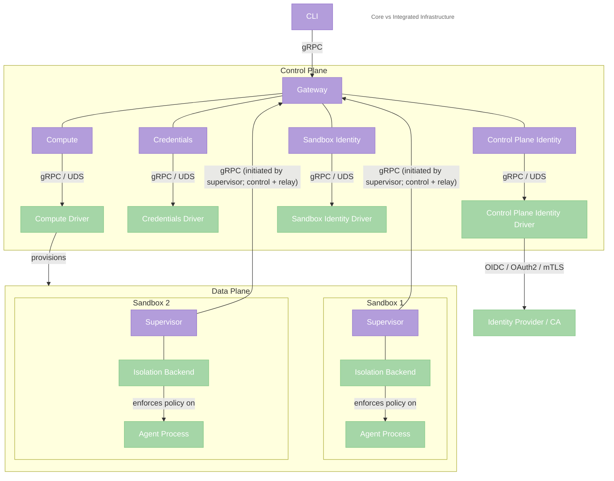
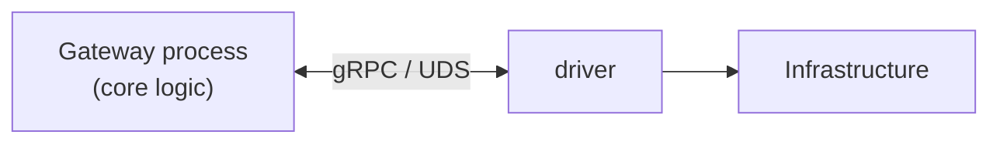

---
authors:
  - "@drew"
state: review
---

# RFC 0001 - Core Architecture

## Summary

This RFC proposes a composable core architecture for OpenShell built around three runtime components -- the **CLI**, the **Gateway**, and the **Supervisor** -- with infrastructure-specific behavior moved behind explicit driver interfaces.

The RFC proposes organizing the gateway around four internal subsystems: **compute** for sandbox lifecycle, **credentials** for secret resolution, **control-plane identity** for gateway authentication and authorization, and **sandbox identity** for supervisor and sandbox workload identity. Each delegates platform-specific operations to a pluggable **driver**, allowing the core gateway to stay stable while different deployment environments provide their own infrastructure adapters.

The RFC also proposes three control-plane constraints: supervisors connect outbound to the gateway rather than being dialed by it, sandbox-to-sandbox traffic is relayed through the gateway in the initial design, and the gateway scales as an active-active multi-replica service with leased ownership of live supervisor sessions.

## Motivation

OpenShell should not be tied to a single infrastructure environment. The core value of OpenShell -- safe, policy-enforced sandboxes for autonomous agents -- should be portable across deployment targets.

Today, the gateway is tightly coupled to Kubernetes. The `SandboxClient` struct directly creates AgentSandbox CRDs via `kube-rs`, watches Kubernetes events, and resolves pod IPs. That coupling makes alternative deployment targets harder to support and forces infrastructure concerns into the core gateway.

At the same time, the coupling surface is narrower than the full system. The gateway depends on Kubernetes for sandbox provisioning, lifecycle watching, and network address resolution, but the rest of the gateway -- persisting state, validating policy, managing SSH sessions, routing inference, and serving the gRPC API -- is not inherently tied to Kubernetes. The supervisor is even less coupled: it runs inside the environment it is given, connects back to the gateway over gRPC, and enforces the security boundary.

This RFC proposes moving those infrastructure-specific responsibilities behind explicit driver interfaces. If we extract drivers at that boundary, the CLI, Gateway, and Supervisor can remain stable while platform-specific behavior lives behind compute, credentials, control-plane identity, and sandbox identity drivers. That keeps the core architecture focused on OpenShell semantics while allowing different deployment environments to provide their own infrastructure adapters.

## Non-goals

- **Rewriting the supervisor.** The supervisor is already platform-aware. This RFC is about the boundary between the gateway and infrastructure, not the internals of the sandbox runtime.
- **Providing first-party drivers for every deployment target.** We define the interfaces and ship reference implementations, but OpenShell's first-party focus is Kubernetes-based deployments. Other environments can be supported by third-party drivers.
- **Prescribing specific technologies or isolation primitives.** This RFC defines contracts and responsibilities. It does not mandate Docker, microVMs, Kubernetes, Kata, gVisor, or any other specific runtime or isolation stack. Those are implementation details left to integrators.

## Proposal

### Core architecture

### Component responsibilities

**CLI.** User-facing interface. Talks to the gateway over gRPC. Manages sandboxes, policies, providers, and inference config. Runs on macOS, Linux, and Windows. Has no knowledge of which driver the gateway is using -- the same commands work regardless of infrastructure.

**Gateway.** The control plane. Owns sandbox state, control-plane identity, sandbox identity, policy, exec sessions, inference routing, the gRPC API, and sandbox-to-sandbox routing/relay. Internally, the gateway coordinates four subsystems -- **compute** (sandbox lifecycle), **credentials** (secret resolution), **control-plane identity** (gateway authentication and authorization), and **sandbox identity** (supervisor and sandbox workload identity) -- each of which delegates platform-specific work to its own pluggable driver. The gateway never initiates connections to sandboxes -- supervisors connect outbound to the gateway, and all control plane communication flows over those supervisor-initiated connections.

**Supervisor.** The security boundary. Runs inside every sandbox environment regardless of how it was created. Enforces network policy (HTTP CONNECT proxy + OPA), filesystem isolation (Landlock on Linux), syscall filtering (seccomp on Linux), and sandbox identity at the workload boundary. Connects back to the gateway over gRPC for config, policy, logs, credentials, and peer relay setup. Adapts to its host platform automatically -- full isolation on Linux, proxy-only on platforms without kernel-level support.

### Gateway interfaces

Within the gateway, four internal subsystems -- **compute**, **credentials**, **control-plane identity**, and **sandbox identity** -- each delegate platform-specific operations to their own driver.

#### Compute

Compute is the gateway subsystem that owns sandbox lifecycle semantics. It decides when sandboxes are created, tracks their state through phase transitions, manages reconciliation, and coordinates teardown. Compute calls its driver's provisioning RPCs (`CreateSandbox`, `DeleteSandbox`, `WatchSandboxes`, `Reconcile`) to execute platform-specific operations, but the lifecycle logic -- retry policies, state machines, ordering -- lives in compute, not the driver.

#### Credentials

Credentials is the gateway subsystem that owns credential resolution semantics. When a sandbox or the gateway needs a secret (an LLM API key, a token, a certificate), credentials maps the logical provider name to a credential, handles caching and rotation, and delivers the secret to the requesting component. It calls its driver's credential access RPCs (`ResolveCredential`, `ListCredentials`) to read from platform-native secret storage, but the resolution logic -- name mapping, caching, rotation policy, delivery -- lives in credentials, not the driver.

Expected credential storage backends (implemented by drivers):

- **macOS Keychain.** Reads credentials from the system Keychain via the Security framework.
- **Linux Secret Service ([freedesktop.org](https://freedesktop.org)).** Reads credentials via the D-Bus Secret Service API (GNOME Keyring, KDE Wallet, KeePassXC, etc.). Falls back to an encrypted file-based store when no D-Bus session is available.
- **Windows Credential Manager.** Reads credentials from the Windows Credential Manager (DPAPI-backed).
- **HashiCorp Vault.** Fetches credentials from Vault using AppRole, Kubernetes auth, or token auth.
- **Kubernetes Secrets.** Reads credentials from Kubernetes Secrets in the gateway's namespace.

#### Control-plane identity

Control-plane identity is the gateway subsystem that determines who is making a request to the control plane and whether they are allowed to perform it. It authenticates CLI users, operators, and external services by delegating to its driver's identity verification RPCs and evaluates authorization policies. Like compute and credentials, control-plane identity owns the business logic -- session management, token caching, and authorization policy evaluation -- while the driver provides the platform-specific authentication mechanism. The current mTLS client-certificate path belongs here as well: it authenticates the caller to the gateway, but it does not establish sandbox workload identity. It is intentionally scoped to control-plane identity only; sandbox and supervisor identity are handled by a separate sandbox identity subsystem.

Expected control-plane identity backends (implemented by drivers):

- **Local OS users.** Maps Linux/macOS system users to gateway identities. The driver trusts the OS-level user identity from the connecting process (for example via Unix domain socket peer credentials). Suitable for local deployments.
- **mTLS client certificates.** Authenticates callers to the gateway with client certificates signed by a trusted CA. This matches the current default gateway authentication mode. Suitable for self-deployed gateways and local deployments, but it remains control-plane authentication rather than sandbox workload identity.
- **OIDC/OAuth2.** Validates bearer tokens from an external identity provider (for example Keycloak, Okta, or Auth0). Suitable for integrating with an external identity provider for control-plane access.
- **Static RBAC.** Role-based access control with roles and bindings defined in the gateway config file. No external dependencies. Suitable for simple built-in access control.

#### Sandbox identity

Sandbox identity is a separate gateway subsystem that manages the identity of supervisors and sandboxes. It is used when a supervisor connects back to the gateway and when the gateway authorizes sandbox-to-sandbox communication. This keeps workload identity distinct from user and operator identity: a human authenticating to the gateway through OIDC is not the same thing as a sandbox proving which workload it is.

Expected sandbox identity backends (implemented by drivers):

- **SPIFFE/SPIRE.** Verifies workload identity via SPIFFE Verifiable Identity Documents (SVIDs). Suitable for workload identity via mTLS between the gateway, supervisors, and supporting infrastructure.
- **Gateway-issued workload identity.** Issues and validates gateway-managed certificates or other bootstrap credentials for supervisors in environments that do not rely on an external workload identity system.

### Driver loading

Each driver is a separate process that the gateway launches and communicates with over gRPC on a local socket. The gateway manages four independent driver processes -- one each for compute, credentials, control-plane identity, and sandbox identity.

**Lifecycle (per driver):**

1. The gateway reads its config to determine which driver to use for each component.
2. It launches each driver process (a binary on disk).
3. Each driver starts a gRPC server on a Unix domain socket (or localhost port).
4. The gateway connects as a gRPC client and calls `GetCapabilities` to verify each driver is ready.
5. Each component calls its own driver over its own gRPC connection.
6. If a driver process dies, the gateway detects the broken connection and can restart it independently.

**First-party drivers** ship alongside the gateway in the container image we publish as separate binaries (for example `openshell-compute-k8s`, `openshell-credentials-vault`, `openshell-control-plane-identity-mtls`, `openshell-control-plane-identity-oidc`, and `openshell-sandbox-identity-spiffe`). OpenShell's first-party driver focus is Kubernetes-based deployments, and the gateway knows how to find and launch those drivers by name.

**Third-party drivers** are binaries that implement the appropriate gRPC service contract (`ComputeDriver`, `CredentialsDriver`, `ControlPlaneIdentityDriver`, or `SandboxIdentityDriver`). The gateway config points to the binary path for each driver, launches it, and connects over a local socket. These drivers are expected to live in their own repositories rather than in the main OpenShell repo.

This model is similar to how HashiCorp tools (Terraform, Nomad) handle plugins -- separate binaries, gRPC communication, no shared address space. The per-component split means drivers can be developed, versioned, and deployed independently. A team can upgrade their credentials driver without touching compute, control-plane identity, or sandbox identity.

### Driver versioning

Because drivers are separate binaries, versioning applies to both first-party and third-party drivers. Each driver API should live under a major-versioned gRPC/protobuf package such as `openshell.compute.driver.v1`, and each driver should expose a `GetCapabilities` handshake that reports its own version, the gateway versions it supports, and any optional features it implements.

Within a given driver API major version, changes should remain backward compatible: new fields, RPCs, and features can be added, but breaking wire or semantic changes require a new major version. The gateway should only load drivers that implement a supported API major version and declare compatibility with the running gateway version. This keeps the contract uniform across first-party and third-party drivers and gives OpenShell a stable path for protocol evolution over time.

### Gateway-supervisor connectivity

All communication between the gateway and supervisors flows over **supervisor-initiated connections**. The gateway never initiates connections to sandboxes. This architectural choice reduces the amount of infrastructure-specific connectivity logic that must live in the gateway.

#### Connection lifecycle

1. Compute instructs its driver to create a sandbox environment and start the supervisor process inside it. The driver passes `OPENSHELL_GATEWAY` as an environment variable.
2. The supervisor connects outbound to the gateway's gRPC endpoint.
3. On connect, the supervisor presents its sandbox identity, identifies itself (sandbox ID, labels), and establishes its long-lived authenticated session with the gateway.
4. The gateway registers the supervisor in its sandbox registry and begins streaming config, policy, and credentials over this connection.
5. All subsequent control plane communication -- config updates, policy pushes, credential delivery, log streaming, exec sessions -- flows over this supervisor-initiated connection.
6. If the connection drops, the gateway marks the sandbox as unreachable. The supervisor reconnects with exponential backoff.

#### Exec sessions

With supervisor-initiated connectivity, exec sessions (interactive shell access) are multiplexed over the supervisor's existing gRPC connection to the gateway. The flow is: CLI sends an exec request to the gateway, the gateway forwards it to the supervisor over the supervisor's inbound gRPC stream, and the supervisor opens a local shell and bridges the I/O.

The specific multiplexing protocol (bidirectional streaming RPC, WebSocket upgrade, etc.) is left to a follow-up RFC. This RFC establishes the architectural constraint: exec flows over the supervisor-initiated connection, not a separate gateway-to-sandbox path.

#### Why not gateway-initiated?

If the gateway initiates connections to supervisors, every driver must solve a connectivity problem: how does the gateway reach into the environment it created? On Kubernetes, it's pod IPs. On Docker, it's port mappings or bridge networks. On a remote machine behind NAT, it's tunnels or relay services. Each driver would need to provide not just an address but a connectivity mechanism, and the gateway would need a pluggable transport layer to use it.

Supervisor-initiated connections invert this. The only networking requirement on the driver is: the supervisor can make an outbound connection to a known endpoint. This reduces the networking assumptions each driver must satisfy.

#### Sandbox-to-sandbox communication

Some workloads require sandboxes to cooperate, for example an orchestrator sandbox calling a worker sandbox. In the initial architecture, sandbox-to-sandbox traffic flows **through the gateway relay**.

**Routing model.** The gateway is both the directory service and the relay. When Supervisor A needs to reach Sandbox B, it asks the gateway by sandbox identity and service name. If policy allows the connection, the gateway opens or binds relay streams on the already-authenticated gateway-supervisor sessions for both sandboxes and forwards traffic between them. The gateway never hands out supervisor-advertised peer endpoints in this model.

This keeps the networking requirements on drivers narrow. The only network requirement is the same one already required for control plane traffic: each supervisor can maintain an outbound gRPC connection to the gateway. Drivers do not need to provide shared-network addressing, DNS, or peer reachability for sandbox-to-sandbox traffic.

**Policy enforcement.** Sandbox-to-sandbox traffic is authorized at relay setup time using the authenticated source sandbox identity, destination sandbox identity, and requested service name. The policy can:

- Allow sandbox A to reach specific services exposed by sandbox B
- Deny all sandbox-to-sandbox traffic by default (full isolation)
- Allow sandbox-to-sandbox but deny internet (air-gapped collaboration)

Because peer traffic is relayed over authenticated gateway sessions, the supervisor does not need to advertise a peer-reachable address and the gateway does not need to trust one. This simplifies the security model for the first version.

**Future evolution.** A later RFC may add direct or more distributed sandbox-to-sandbox transport as an optimization for high-bandwidth or low-latency workloads. If we do that, it must preserve the same authorization model and introduce an authenticated binding between sandbox identity and any advertised peer endpoint before the gateway can hand it out.

### Horizontal scaling

The gateway runs in active-active mode. Multiple gateway replicas may serve the same cluster at once, with no single controller replica in normal operation. Durable state -- sandboxes, policies, settings, sessions, and lease records -- lives in a shared transactional store, while live state -- active supervisor connections, relay streams, exec streams, and hot-path indexes -- remains local to the replica that owns a supervisor session.

Each supervisor connection is owned by exactly one gateway replica at a time through a renewable lease record in the shared store. Any replica may accept client requests, but requests that need a live supervisor session -- such as exec, policy push, log streaming, or peer relay setup -- are forwarded to the owning replica. This keeps the hot path edge-triggered and in-memory while preserving a single logical control plane across many replicas.

Background coordination must also avoid a singleton controller. Reconciliation, repair, and similar control-plane tasks should be split into leased work units or shards so replicas can claim and process them independently. Production multi-replica deployments therefore require a shared backend with transactional coordination semantics, such as Postgres; SQLite remains a single-node development backend.

### Published Artifacts

This architecture ships as three core binaries, a standalone VM binary for quick single-player getting started, two container images, and a Kubernetes deployment story.

#### Binaries

`openshell` **(CLI).** The user-facing binary. Distributed as a standalone executable for macOS (aarch64, x86_64), Linux (aarch64, x86_64), and Windows (x86_64). Talks to the gateway over gRPC. No runtime dependencies beyond the OS.

`openshell-gateway` **(Gateway).** The control-plane binary. Runs the gRPC API server, manages sandbox state, coordinates the compute/credentials/control-plane-identity/sandbox-identity subsystems, and launches driver processes. Distributed as a standalone executable and as the entrypoint of the gateway container image.

`openshell-supervisor` **(Supervisor).** The sandbox-side security boundary. Runs inside every sandbox environment, connects outbound to the gateway, and enforces policy. Distributed as a standalone executable and as the entrypoint of the supervisor container image.

`openshell-vm` **(VM).** The single-player runtime. Launches a lightweight microVM (via libkrun) that embeds both the gateway and supervisor in a single local VM, providing a fully self-contained sandbox environment without requiring a cluster or container runtime. Distributed as a standalone executable for macOS and Linux. Used by the CLI when running in single-player mode.

#### Container images

**Gateway image.** Contains the `openshell-gateway` binary plus first-party driver binaries (for example `openshell-compute-k8s`, `openshell-credentials-vault`, `openshell-control-plane-identity-mtls`, `openshell-control-plane-identity-oidc`, and `openshell-sandbox-identity-spiffe`). This is the unit of deployment for the control plane in containerized environments. Drivers that ship in-image are usable by name in the gateway config without specifying a binary path.

**Supervisor image.** Contains the `openshell-supervisor` binary and the minimal runtime dependencies needed to enforce policy inside a sandbox. This image is pulled by the compute driver when provisioning sandbox environments. It is intentionally minimal -- the supervisor does not need build tools, package managers, or anything beyond what is required to run the supervisor process and its isolation backends.

#### Kubernetes

For Kubernetes-based deployments, OpenShell ships a Helm chart and an operator in addition to the container images described above. Kubernetes is an officially supported installation method from the core OpenShell project.

## Risks

- **Process management complexity.** The gateway now manages four child processes (one driver per component) in addition to its own concerns. This adds failure modes: driver crashes, startup races, socket cleanup, signal forwarding -- multiplied across four processes. Mitigation: keep the process lifecycle simple -- launch, health check, restart on failure -- and lean on the OS for process supervision where possible. Each driver is independent, so a credentials driver crash doesn't take down compute, control-plane identity, or sandbox identity.
- **Platform-dependent isolation guarantees.** The supervisor provides different isolation levels depending on the host OS -- full kernel-level enforcement (Landlock, seccomp, network namespaces) on Linux, proxy-only enforcement elsewhere. Users may expect uniform security properties across platforms. Mitigation: the supervisor reports its effective isolation level via `IsolationModel`, the gateway surfaces this to users, and documentation and CLI output make the effective security boundary explicit for each platform.
- **Single-stream supervisor control path.** All gateway-to-supervisor communication -- config, policy, credentials, logs, exec sessions -- flows over one supervisor-initiated gRPC connection. Silent stream failures (load balancer idle timeouts, TCP half-open states) sever all communication until reconnection. Multiplexing diverse traffic risks head-of-line blocking (log bursts delaying exec keystrokes) and priority inversion (policy revocations queued behind bulk data). Reconnection requires state reconciliation: exec sessions are lost, credential deliveries need retry, policy must re-sync. Mitigation: HTTP/2 multi-stream framing avoids application-layer head-of-line blocking, gRPC keepalives detect silent failures, and the reconnection protocol should be idempotent -- full state snapshot on reconnect, not message replay. Critical operations (policy, credentials) should use dedicated streams separate from bulk traffic (logs, exec I/O).
- **Sandbox-to-sandbox relay abuse.** In the initial architecture, all peer traffic is relayed through the gateway over the same authenticated sessions used for control plane communication. A misbehaving or compromised sandbox could saturate the relay path with peer traffic, consuming gateway memory and bandwidth and degrading policy, credentials, logs, or exec for other sandboxes. Mitigation: per-sandbox rate limiting and bandwidth caps on relayed traffic, separate HTTP/2 streams or dedicated relay channels for peer traffic vs. control plane operations, and monitoring/alerting on relay utilization so operators can identify abusive sandboxes before they impact the fleet.

## Alternatives

### 1. In-process Rust trait instead of gRPC service

Define the driver interface as a Rust trait. First-party drivers are compiled into the gateway. Third-party drivers use dynamic linking (`cdylib`).

**Rejected.** A Rust trait is simpler for first-party development, but it locks third-party drivers into Rust (or C FFI), makes dynamic loading fragile across compiler versions, and couples driver releases to the gateway binary. The gRPC service approach trades a small amount of serialization overhead for language independence, process isolation, and independent deployability. The per-component driver split amplifies these benefits -- each driver can be developed and deployed in any language, independently of the others. The overhead is negligible for sandbox lifecycle, credential, control-plane identity, and sandbox identity operations (which are already I/O-bound).

### 2. Use an existing runtime interface (CRI, OCI)

Adopt an existing container runtime interface as the driver abstraction.

**Rejected.** These interfaces are container-specific and coupled to the pod/container model. Our interface is higher-level: "create an environment where the supervisor can run." That environment might be a container, a VM, a process, or something else entirely. Additionally, CRI has no concept of credential access or either identity layer, and our architecture separates these into independent drivers -- compute, credentials, control-plane identity, and sandbox identity -- each with its own contract.

### 3. Gateway-initiated connections to supervisors

Have the gateway initiate connections to supervisors (the "traditional" direction). The driver resolves sandbox addresses and the gateway connects to them directly.

**Rejected.** This requires every driver to solve a connectivity problem: how does the gateway reach into the environment it created? On Kubernetes it's pod IPs, on Docker it's port mappings, on remote machines it's tunnels or relay services. Each driver would need to provide not just an address but a connectivity mechanism, and the gateway would need a pluggable transport layer to consume it. Supervisor-initiated connections invert this entirely -- the only requirement is that the supervisor can make an outbound connection to a known endpoint, which reduces the networking assumptions each driver must satisfy. The tradeoff (exec latency, gateway as relay) is acceptable for the common case.

### 4. Controller-led gateway architecture

Run the gateway as a controller-led control plane with one leader or controller replica responsible for reconciliation, sandbox session ownership, and peer relay coordination, while other replicas remain standby or serve limited frontend traffic. This is closer in shape to a Kubernetes-style controller architecture, whereas the design proposed in this RFC is closer to a Nomad-style active-active control plane with leased ownership of live sessions.

**Rejected.** A controller-led architecture simplifies some coordination paths because reconciliation, live session ownership, and relay routing all converge on a single control-plane role. But it also reintroduces a singleton bottleneck for live supervisor traffic, makes failover more disruptive, and works against the horizontal-scaling model proposed in this RFC. This RFC instead chooses an active-active gateway architecture with leased ownership of supervisor sessions and sharded coordination work so the control plane can scale horizontally without a permanent controller replica.

## Prior art

- **Kubernetes CRI.** gRPC interface between kubelet and container runtimes. Similar concept (pluggable runtime) but scoped to containers and tightly coupled to the Kubernetes pod model.
- **Nomad task drivers.** Plugin-based model supporting multiple execution environments through a common interface. Demonstrates that a minimal driver contract can support a wide range of infrastructure.
- **Terraform providers.** Core defines a provider interface; implementations target different infrastructure. Core is infrastructure-agnostic. Same principle as our gateway-driver split.
- **VS Code Dev Containers / Codespaces.** Same dev container spec runs locally (Docker) or remotely (cloud VM). Tooling adapts to available infrastructure. Analogous to our supervisor running in any driver-provided environment.
