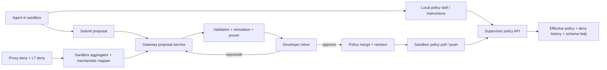
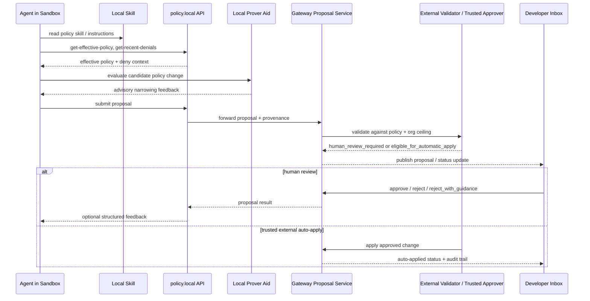

---
authors:
  - "@alwatson"
state: draft
links:
  - https://github.com/NVIDIA/OpenShell/issues/1062
  - https://github.com/NVIDIA/OpenShell/blob/main/architecture/policy-advisor.md
---

# RFC 0002 - Agent-Driven Policy Management

<!--
See rfc/README.md for the full RFC process and state definitions.
-->

## Summary

Evolve OpenShell's existing Policy Advisor into an agent-driven policy management system that lets agents inspect current sandbox policy, draft narrow policy changes, submit them for review, and apply approved updates without restarting the sandbox. The safety model stays the same: sandbox-side analysis, gateway-side validation and persistence, and explicit approval boundaries. The main change is the authoring and review experience: every sandbox should expose local policy guidance and APIs, and every developer surface should expose a responsive inbox for reviewing proposals.

## Motivation

OpenShell already has the core of a dynamic policy editing experience:

- The sandbox proxy emits deny events.
- The sandbox-side `DenialAggregator` and mechanistic mapper convert those into draft `PolicyChunk` proposals.
- The gateway persists proposals and merges approved rules into the active policy.
- The TUI and CLI already provide review and approval flows.
- Running sandboxes already hot-reload dynamic policy updates.

That is a strong foundation, but the current experience is still fundamentally operator-driven and network-centric. It is excellent for "observe a deny, approve a generated endpoint rule" but incomplete for the broader product promise: an agent should be able to understand what is blocked, discover what policy language is available, generate the narrowest valid policy change, and submit it to the developer with enough rationale and verification signal that approval is fast and trustworthy.

This matters because:

- developers should not need to learn policy syntax before becoming productive
- agents have the most task context and can often draft narrower changes than humans
- approvals should feel like reviewing a validated outcome, not guessing about a YAML diff
- the inbox experience must be fast and clear across TUI, CLI, and SDK surfaces
- organizations need a path from human approval to trusted bounded automation without losing auditability or least privilege

This RFC proposes the next layer: make policy adaptation an intentional, agent-native workflow instead of a reactive operator convenience.

## MVP implementation note

The first implementation is tracked in [#1062](https://github.com/NVIDIA/OpenShell/issues/1062). It intentionally starts with the smallest agent-driven loop that can validate the product experience:

- structured L7 REST deny responses for agent-readable failures
- a sandbox-local `policy.local` HTTP API backed by existing files, logs, and per-sandbox mTLS gateway calls
- static sandbox-local agent guidance in `/etc/openshell/skills/policy_advisor.md`
- agent-authored proposal provenance, validation status, and rejection guidance in the existing draft policy flow
- TUI/CLI review for a single sandbox, with polling as the MVP refresh path

The MVP deliberately defers the supervisor Unix-socket API, server-streaming multi-sandbox inbox, Slack/web adapters, org ceilings, trusted auto-apply, and in-process prover optimization. Those remain aligned with the RFC direction, but they are not required to prove the initial loop.

The entire MVP surface is gated behind the `agent_policy_proposals_enabled` setting (see `crates/openshell-core/src/settings.rs`), default false. When disabled, the supervisor does not install the skill, the `policy.local` routes return `404 feature_disabled`, and L7 deny bodies omit the `next_steps` array. The flag is independent of the per-proposal developer approval gate; both apply when the feature is on. Treat this as a soft launch: enable per-sandbox or globally once the loop is validated, and leave it off in environments where agent-authored proposals should not be available at all.

## Non-goals

- Allowing an in-sandbox agent to self-approve or unilaterally apply its own policy changes.
- Moving proposal generation into the gateway. Sandbox-side analysis remains the architectural default.
- Solving every policy domain in the first release. Network policy is the initial scope because it is the only hot-reloadable policy domain in the current architecture; filesystem and process policy can follow later through a different lifecycle model.
- Replacing the existing mechanistic mapper. It remains the deterministic baseline and safety net.
- Making Rego authoring a direct end-user requirement. The system should expose policy semantics to agents and advanced users, not require hand-authored policy for common workflows.

## Proposal

### Enforcement model

This RFC is not proposing a generic "policy update" system without specifying what gets enforced. The intended model is layered:

- **L4 remains the universal baseline**
  Every outbound connection is gated by host, port, and binary identity.
- **L7 is the preferred least-privilege model for supported application protocols**
  Today this primarily means `protocol: rest` with per-method and per-path rules for HTTP APIs.
- **Protocol-aware or tool-aware policy layers may sit above L7 where useful**
  MCP is a strong candidate for a future higher-level enforcement surface, but it should be modeled explicitly rather than implied.

For the initial implementation of this RFC, dynamic policy management should be grounded in the enforcement model OpenShell already has in the codebase today:

- L4 network policy for all outbound traffic
- L7 REST enforcement for HTTP APIs where `protocol: rest` is configured
- policy prover checks that can distinguish L4-only access from L7-enforced access

This matters because "allow GitHub" is not a single thing:

- `github.com:443` used by `git` may require L4-only allowance depending on the workflow and protocol behavior
- `api.github.com:443` used by `gh`, `curl`, or an SDK is often a great fit for L7 REST controls
- the best least-privilege design often splits those paths rather than treating GitHub as one broad capability

This RFC is therefore network-first by design, not because other policy domains are unimportant, but because the current OpenShell architecture only supports live mutation of `network_policies`. Filesystem, Landlock, and process settings are applied at sandbox startup and are currently immutable for the lifetime of a sandbox.

### Product direction

Every OpenShell sandbox should be able to host an agent-capable policy workflow with four core affordances:

1. A local capability description that teaches an agent how to inspect current policy state, understand the available policy language, and submit a proposal for review.
2. A sandbox-local or supervisor-adjacent API for reading effective policy, recent denials, sandbox-local activity logs, and proposal state.
3. A gateway-managed developer inbox for reviewing, editing, approving, rejecting, and auditing proposals in real time.
4. A validation pipeline that checks proposed policy changes before they are applied.

The product bar is not just correctness. The interaction model itself must be good:

- proposals should appear quickly after a deny or agent request
- review surfaces should be understandable without policy expertise
- the same proposal should look coherent in the TUI, CLI, and SDKs
- approval should take one action when the system has high confidence
- high-volume exploratory agent workflows should not drown the user in repetitive prompts

### UX requirements and latency targets

For the developer inbox experience:

- OpenShell **must provide a push/subscription path** for proposal and decision updates to the TUI, CLI, and SDKs.
- Polling may exist as a fallback, but polling-only delivery is not sufficient for the intended UX.

Target UX metrics:

- **Proposal appearance latency**
  From the time the gateway accepts a proposal or actionable deny-derived recommendation to the time it appears in a connected inbox client:
  - target `p50 <= 2s`
  - target `p95 <= 5s`
- **Decision propagation latency**
  From approval, rejection, edit, or auto-apply at the gateway to the time all connected inbox clients reflect the new state:
  - target `p50 <= 1s`
  - target `p95 <= 3s`
- **Activation feedback latency**
  From gateway receipt of sandbox policy status (`loaded` or `failed`) to visible client state update:
  - target `p50 <= 1s`
  - target `p95 <= 3s`

If sandbox policy activation takes longer than these targets, the inbox should still update immediately with an intermediate state such as `pending_activation` rather than leaving the user uncertain.

The desired user experience:

1. An agent encounters a deny with a structured explanation from the sandbox supervisor.
2. The agent uses a local policy-management skill to inspect the current effective policy, denial context, and relevant policy primitives.
3. The agent produces a minimal proposed change and submits it through a stable proposal API.
4. The developer sees the proposal in the TUI, CLI, or SDK, reviews its rationale and validation results, and approves or rejects it.
5. OpenShell applies the approved change as a hot-reloaded policy update and preserves a durable audit trail.

### What exists today

The RFC explicitly builds on the current codebase rather than replacing it.

Current implementation points:

- `crates/openshell-sandbox/src/denial_aggregator.rs`
  Sandbox-side aggregation of deny events.
- `crates/openshell-sandbox/src/mechanistic_mapper.rs`
  Deterministic generation of draft `PolicyChunk` recommendations, including partial L7 support.
- `crates/openshell-server/src/grpc/policy.rs`
  Persistence, approval, merge, rejection, edit, undo, and policy revision handling.
- `crates/openshell-tui/src/ui/sandbox_draft.rs`
  TUI review and approval surface for network rules.
- `crates/openshell-cli/src/run.rs`
  `openshell rule get|approve|reject|approve-all|history`.
- `architecture/policy-advisor.md`
  Current sandbox-side recommendation design.

Important capabilities that already exist and should be preserved:

- sandbox-side proposal generation
- hot-reloadable policy updates
- proposal editing and undo RPCs in `proto/openshell.proto`
- durable draft chunk storage and approval history
- a deterministic, mechanistic proposal path that does not require an LLM
- a real distinction between L4-only and L7 REST enforcement

### What is missing

The current implementation lacks several parts required for the intended developer experience:

- A standard in-sandbox skill or instruction bundle for local agents.
- A first-class proposal API that agents can use intentionally, not only through deny-triggered analysis.
- Rich proposal context beyond host/port/binary, especially for developer intent, repository/task context, and write operations.
- Validation outputs that explain what a proposal would permit before approval.
- A generalized "developer inbox" model that can power the TUI, CLI, SDK, and future Slack/web surfaces from the same backend abstraction.
- A clear separation between:
  - observed deny events,
  - agent-authored policy changes,
  - validated approval-ready proposals,
  - applied policy revisions.
- A trust model for non-human approvers, where a trusted external agent may apply policy changes automatically when those changes remain within an organization-defined maximum policy envelope.
- Explicit proposal semantics for whether a recommendation is:
  - L4-only
  - L7 REST
  - a conversion from L4 to L7
  - a future protocol-aware policy type such as MCP-aware controls

### Architecture

The important architectural principle is that the current Policy Advisor pipeline becomes one producer of proposals, not the only producer. Agent-authored proposals and mechanistic proposals should land in the same gateway inbox and go through the same validation and approval machinery.

The second architectural principle is that approval is policy-driven. Human approval is the default mode, but the same machinery must also support a trusted external control plane deciding that a proposal is safe to auto-apply because it fits under higher-level organizational constraints.

The end-to-end interaction should look like this:

### Core design concepts

#### 1. Policy workspace inside every sandbox

Every default sandbox should expose a stable local "policy workspace" that agents can rely on. This is not necessarily a mutable file checked into the user's repo; it is a capability surface available from inside the sandbox.

The workspace should provide:

- Effective sandbox policy, already resolved to the currently active version.
- Policy schema and examples relevant to the sandbox's supported policy features.
- A description of approval workflow semantics.
- Recent denials, sandbox-local activity logs, and related proposal history.
- Guidance for generating the narrowest change possible.

The first implementation can be a static `/etc/openshell/skills/policy_advisor.md` plus a sandbox-local `policy.local` HTTP API. The long-term contract is the API; the skill is the ergonomic on-ramp. MCP can wrap this API later for agents that benefit from tool discovery, but it should not be the first load-bearing protocol or a separate implementation path.

The sandbox-facing surface must also have an explicit information boundary:

Visible to the in-sandbox agent:

- the current effective sandbox policy
- deny reasons, sandbox-local logs, and local proposal history for that sandbox
- supported policy primitives and examples
- coarse proposal outcomes such as `needs_human_review`, `eligible_for_external_review`, or `rejected_for_safety`

Not exposed directly to the in-sandbox agent:

- the full org ceiling policy document
- trusted external approver policies or scoring heuristics
- hidden approval thresholds
- policy state for other sandboxes, users, or org workflows

Ceiling evaluation, trust decisions, and automatic-apply eligibility should be computed outside the sandbox.

OpenShell should also make prover-backed analysis available to agents as a proposal-authoring aid. This lets an agent test whether a candidate policy is broader than necessary and iterate toward a narrower proposal before submission. Inside the sandbox, prover output is advisory and used for drafting only. Approval and automatic-apply decisions must still rely on external validation in the gateway or trusted approver path.

#### 2. Intentional proposal submission API

Add a supervisor-facing proposal API so an agent can submit policy updates even before or after a deny aggregation cycle.

Example agent actions:

- "Show me the current policy affecting `git`."
- "Explain why this GitHub push was denied."
- "Draft the minimal rule to allow writes to `github.com` and `api.github.com` for `git` only."
- "Submit this proposal for human review."

This proposal path should support two modes:

- `draft_from_observation`
  Builds on real deny history.
- `draft_from_agent_intent`
  Allows an agent to proactively request a change based on planned work.

Both should land in the same inbox with provenance captured.

When multiple producers submit effectively the same proposal, the gateway should apply a deterministic merge policy:

- mechanistic proposals establish the baseline proposal record
- richer agent-authored proposals for the same sandbox + endpoint + binary may upgrade the existing record's rationale, context, and proposed L7 refinement
- fallback observation updates may continue to bump hit counts and timestamps without discarding richer metadata

The important product requirement is that a richer agent proposal must not be silently lost behind an earlier mechanistic proposal.

#### 3. Proposal model evolution

Extend the existing `PolicyChunk`/draft-chunk model into a more expressive proposal object while preserving backward compatibility for current rule review commands.

Additional fields should include:

- Proposal source: mechanistic, agent-authored, or hybrid.
- Requested capability summary in plain language.
- Validation status and findings summary.
- Diff against current effective policy.
- Enforcement layer for first-release proposal types:
  - `l4`
  - `l7_rest`
- Intended scope:
  - endpoint-only
  - L7 method/path
  - binary restriction
  - time-bounded or session-bounded, if supported later
- Optional task context:
  - repo URL
  - issue/RFC reference
  - command or tool that triggered the need

The inbox should make it obvious whether a proposal is an L4 tunnel, an L7 REST rule, or a conversion from broad access to narrower L7 controls.

Future protocol-aware proposal kinds such as MCP-aware controls should extend the model later rather than forcing the first-release schema to generalize prematurely.

#### 4. Validation before approval

Approval should present validated consequences, not just a proposed rule.

Validation stages:

1. Schema and static safety validation.
2. Deterministic simulation:
   - what new hosts, ports, methods, or binaries would become reachable
   - whether the change overlaps or broadens an existing rule
   - whether the proposal is L4-only or protected by L7 enforcement
3. Policy-specific safety checks:
   - always-blocked destinations
   - suspicious private IP overrides
   - wildcard or full-access expansions
   - binaries or protocols that bypass L7 inspection
4. Formal verification when supported:
   - use the existing prover infrastructure to check that the proposal satisfies a declared intent and does not exceed it

The validator should emit an approval summary such as:

- "Allows `git` to `github.com:443` and `api.github.com:443`."
- "Does not grant access to other GitHub hosts."
- "Adds write-capable REST paths for repo push semantics."
- "Touches only dynamic network policy."
- "This change is L4-only and does not provide method/path restriction."
- "This change upgrades the endpoint to L7 REST enforcement."

Validation should also support two decision modes:

- `human_review_required`
  The proposal is shown in the developer inbox for explicit approval.
- `eligible_for_automatic_apply`
  The proposal remains within a trusted approval envelope and may be applied automatically by policy.

For first release, the recommended automatic-apply scope is intentionally narrow:

- trusted external approver only
- network policy only
- L7 REST preferred where supported
- ephemeral lease durability by default
- only when prover, validation, and org ceiling checks succeed without ambiguity

#### 4a. Structured deny feedback

Denied operations should not only appear in logs and inboxes. OpenShell should also provide a structured deny feedback path that helps the in-sandbox agent recover intelligently by returning:

- a machine-readable explanation of what was denied
- the relevant enforcement layer (`l4` or `l7_rest`)
- the reason the current policy did not allow it
- a pointer to the local policy workspace/API for inspection and proposal drafting

The delivery mechanism may vary, but the RFC requires this to be a first-class capability rather than only an operator-facing side effect.

#### 5. Unified developer inbox

The existing draft-chunk review surface should become a generalized developer inbox with:

- Real-time updates from the gateway.
- Filterable by sandbox, status, source, severity, and validation state.
- Renderable in:
  - TUI
  - CLI
  - SDK/API
  - future Slack/web integrations
- Support for:
  - approve
  - reject
  - reject with guidance
  - edit
  - bulk approve with safeguards
  - undo
  - audit/history inspection

The current TUI "Network Rules" panel is the correct seed, but the mental model should shift from "network rules list" to "policy proposal inbox."

To support the UX targets above, the inbox architecture should include a subscription mechanism from the gateway to clients, such as streaming gRPC, SSE, or an equivalent event feed. The exact transport can be implementation-specific, but the user-visible behavior should be push-first.

Rejection should be part of a revise-and-resubmit loop rather than a dead end. Operators should be able to reject a proposal with explanation so the agent can draft a narrower or corrected follow-up without requiring the operator to hand-author the policy change themselves.

#### 6. L7-first agent experience

A major product requirement is enabling strong default sandboxes with granular approval flows, especially for APIs like GitHub:

- The default sandbox permits read-only GitHub API access via L7 policy.
- An agent attempts a write operation.
- The sandbox returns a structured deny that tells the agent:
  - what was blocked,
  - what part of policy caused the denial,
  - how to inspect current policy,
  - how to submit a narrow proposal.
- The agent proposes the smallest change needed for the target repo/workflow.
- The developer reviews a proposal phrased in task terms, not raw YAML only.

OpenShell should explicitly steer the system toward the narrowest viable enforcement level:

- prefer L7 REST rules for HTTP APIs such as GitHub, LinkedIn, X, Slack, Jira, and similar services
- fall back to L4 only when the protocol or client behavior prevents meaningful L7 enforcement
- tell the developer when a proposal is broad because the workload itself is broad, not because the system failed to model it precisely

### REST, L4, and MCP

REST APIs are the clearest near-term least-privilege win because OpenShell already supports `protocol: rest`, access presets, explicit method/path rules, TLS termination, and prover logic that can distinguish L4-only access from L7 write exposure. L7 REST should therefore be the default recommendation path for HTTP APIs, while L4-only proposals remain available for non-HTTP or opaque clients and should be clearly marked as broader access. MCP remains strategically important, but it should not drive the first-release schema: remote MCP still rests on transport controls such as HTTP/SSE/WebSocket, while local stdio MCP does not map neatly to network enforcement. The near-term plan is simple: **Phase 1-4 focus on L4 + L7 REST policy management; MCP-aware controls land as a later dedicated track.**

#### 7. Trusted external approvers and policy ceilings

Human approval should remain the default, but the system should also support a second mode where a trusted agent outside the sandbox can approve and apply changes automatically on behalf of the user when:

- the organization defines an immutable high-level policy ceiling
- the sandbox policy starts below that ceiling
- the agent proposes a narrower incremental change needed to complete a task
- the prover and policy validator can show that the change stays within the allowed envelope

In this model:

- the org-level ceiling acts as a non-bypassable maximum
- sandbox policy revisions can expand only within that ceiling
- a trusted external agent or control-plane service may auto-apply compliant changes
- every request, validation result, and applied revision is logged for audit

This gives OpenShell a path to adaptive least privilege without forcing a human to approve every safe change in real time.

### Trust and approval model

OpenShell should support at least three approval modes:

1. `human_in_the_loop`
   Every proposal requires explicit user approval.
2. `trusted_agent_within_ceiling`
   A trusted external agent may apply changes automatically when validation and prover checks confirm the proposal stays within an org or user-defined maximum.
3. `manual_only_locked_down`
   No automatic apply; some proposals may be visible but categorically blocked from execution by policy.

The RFC does not propose allowing an in-sandbox agent to self-approve its own policy requests. Trusted external auto-apply is **in scope**, but it is distinct from autonomous in-sandbox mutation. The minimum shippable baseline is still a strong human-in-the-loop workflow.

### Organizational policy layering

This RFC assumes policy layering rather than a single mutable document:

- `org ceiling policy`
  The maximum capability envelope defined by security or platform teams.
- `sandbox effective policy`
  The currently active policy for a sandbox, always a subset of the org ceiling when one exists.
- `proposal diff`
  The incremental change requested by an agent or generated from deny analysis.

For a proposal to be auto-applied, it must satisfy all of:

1. valid OpenShell policy schema and merge semantics
2. no violation of always-blocked destinations or other hard safety rules
3. no violation of org ceiling constraints
4. successful prover or simulation checks against declared assumptions
5. successful audit logging and attribution

If any check fails, the proposal falls back to human review or outright rejection.

### Durability model

Policy changes should not all have the same lifecycle. This RFC proposes three durability classes:

1. `ephemeral_lease`
   A time-bounded grant that expires automatically unless renewed. This is the recommended default for automatically applied expansions.
2. `sandbox_durable`
   A durable revision for a specific sandbox or long-lived workflow. Suitable for human-approved changes or explicit promotion from a lease.
3. `promoted_policy_artifact`
   A reusable policy artifact intended for future sandboxes, templates, or org-managed defaults.

Recommended defaults:

- auto-applied trusted-agent changes should start as `ephemeral_lease` unless explicitly promoted
- human-approved changes may become `sandbox_durable` directly when the reviewer intends lasting behavior
- promotion into reusable artifacts should be a deliberate step

### Reject with guidance

Operators should be able to do more than approve or reject. The system should support a guided rejection path:

- `approve`
  Accept and apply the proposal.
- `reject`
  Decline the proposal without expecting an immediate follow-up.
- `reject_with_guidance`
  Decline the proposal while returning operator guidance that the agent can use to revise and resubmit.

Guidance may include free-form explanation plus structured hints such as `too_broad`, `use_l7_not_l4`, `wrong_binary_scope`, `wrong_endpoint`, `needs_time_limit`, or `outside_org_ceiling`.

### Example: trusted daily research workflow

One motivating workflow is a recurring research task: search X and LinkedIn for posts about a topic, summarize the results, and email the summary to the user. In that flow, the sandbox may start with minimal permissions plus an email provider, then request new outbound access to X and LinkedIn. A trusted external policy agent can prefer L7 REST rules when possible and apply them automatically when they fit within the organization's permitted research ceiling.

### API and component changes

#### Sandbox supervisor

Add a local policy interaction surface:

- sandbox-local `policy.local` HTTP API
- optional future MCP wrapper backed by that API

Representative operations:

- read effective policy, recent denials, and sandbox-local activity logs
- inspect proposal guidance and current proposal state
- submit a policy proposal

This surface must be readable by the agent but not self-approving.

Phase 2 implementation decisions:

- primary transport: sandbox-local HTTP JSON at `policy.local`
- ergonomic wrapper: defer MCP/CLI wrappers until the local API proves useful
- first trust model: the sandbox is treated as single-tenant, so local callers are part of the sandbox tenant; this does not grant approval rights
- first proposal format: reuse the `PolicyMergeOperation` shape behind `openshell policy update` inside a JSON request body; the supervisor/local service bundles those operations with intent, summary, and optional evidence references, sends them to the gateway over gRPC, and the gateway stores them as draft chunks for approval instead of applying them immediately

#### Gateway / server

Extend the gateway proposal service to support:

- explicit agent-authored proposal submission
- richer proposal metadata
- validation result persistence
- inbox subscriptions for multiple frontends
- trusted approver identities and authorization policies
- automatic-apply decisions gated by org ceiling and validation outcomes
- enforcement-layer-aware summaries and diffing
- durability classes and lease expiration metadata
- rejection reasons and operator guidance that can feed follow-up proposals
- stronger audit records tying:
  - deny event(s)
  - proposal author/source
  - approval decision
  - resulting policy revision

The existing gRPC policy service is the natural place to grow this.

#### TUI, CLI, and SDK

The TUI should evolve from the current rules panel into a richer inbox with proposal summaries, validation state, diff views, edit-before-approve flow, and a clear distinction between "awaiting you" and "already auto-applied within policy ceiling." The CLI should preserve `openshell rule` for compatibility while introducing clearer proposal-centric aliases, and CLI/SDK surfaces should expose the same approval metadata so integrators can build their own inboxes and automation.

## Implementation plan

### Phase 1: Productize the current Policy Advisor

Goal: turn the existing network rule draft flow into a first-class, polished foundation.

Deliverables:

- Rename and frame the current draft-chunk system internally as a proposal inbox.
- Add proposal provenance fields and validation summary fields.
- Improve TUI and CLI language to emphasize reviewable proposals.
- Document the current approval loop as a stable workflow.
- Set explicit UX targets for proposal latency and review responsiveness.
- Add a push/subscription path for proposal and decision updates to inbox clients.
- Audit existing `PolicyChunk` and draft-chunk persistence fields, then either hydrate, deprecate, or remove hollow fields before extending the model further.

This phase is mostly packaging and data-model hardening on top of existing code in:

- `crates/openshell-sandbox`
- `crates/openshell-server`
- `crates/openshell-tui`
- `crates/openshell-cli`

### Phase 2: Local agent skill and supervisor policy API

Goal: let any agent in a sandbox intentionally inspect and draft policy changes.

Deliverables:

- Generated sandbox-local `policy_advisor.md` or equivalent instruction bundle.
- Supervisor read APIs for policy state, denials, local activity logs, and capabilities.
- Initial proposal submission API.
- Structured deny messages that point agents to the local policy workflow.
- Feedback path so agents can read operator rejection guidance and iterate on a proposal.

This is the point where the feature becomes broadly useful to OpenClaw, Claude Code, Cursor, and other agents.

### Phase 3: Validation and simulation

Goal: make approval trustworthy and fast.

Deliverables:

- Policy diff generation.
- Consequence summaries for proposed changes.
- Integration with prover/simulation infrastructure where available.
- Clear validation statuses in TUI and CLI.
- Org ceiling checks and trusted-agent auto-apply eligibility.
- Clear reporting for L4-only versus L7-enforced proposals.
- Safety-aware redaction so sandbox-local introspection does not expose full ceiling internals.

This phase is critical before broadening beyond simple endpoint approvals.

### Phase 4: Rich L7 authoring and GitHub write flow

Goal: demonstrate the full UX on a high-value developer workflow.

Deliverables:

- Structured GitHub write-policy proposals from agent intent.
- Support for method/path-level rule authoring via agent workflow.
- Validation tuned for common provider/API patterns.
- Demo and tutorial flows centered on repo write access.

This phase should produce the canonical blocked-write upgrade experience.

### Phase 5: Generalized inbox surfaces

Goal: expose proposal review outside the TUI.

Deliverables:

- Stable SDK/API for proposal feeds and decisions.
- CLI parity for all proposal operations.
- Optional Slack/web notification adapters.

### Phase 6: Trusted automation and recurring workflows

Goal: support safe automatic policy evolution for approved automation patterns.

Deliverables:

- policy ceiling model for org or platform admins
- trusted external approver identity model
- automatic apply path when proposals stay within ceiling
- audit trail and reporting for auto-applied revisions
- lease-based durability for automatically applied changes
- reference workflow for recurring research-and-email automation

### Future phase: protocol-aware policy adapters

Goal: extend dynamic policy management beyond REST where higher-level semantics exist, including MCP-aware policy controls, richer SQL enforcement once enforce-mode support exists, and protocol-specific adapters for common tool ecosystems.

## Migration and compatibility

The intended rollout is additive-first.

- Existing `openshell rule` commands should continue to work while proposal-centric APIs and UX are introduced.
- Existing mechanistic sandboxes should remain compatible with a newer gateway during the transition.
- Database and proto evolution should prefer additive fields and compatibility shims before any cleanup of legacy draft-chunk semantics.
- If proposal semantics outgrow the current draft-chunk schema, migration should preserve existing pending, approved, and rejected records rather than discarding inbox history.

## Risks

- Agent-authored proposals may overfit to task success and underweight least privilege.
- A local skill that teaches policy mutation could be abused if submission and approval boundaries are not crisp.
- Validation that is too weak will make approvals feel unsafe; validation that is too noisy will make the UX slow and frustrating.
- Expanding too quickly from network policy into filesystem/process policy could blur scope and delay a polished first release.
- Adding multiple proposal producers without a unified model could create duplicate or conflicting inbox entries.
- If the inbox UX is not excellent, developers may perceive OpenShell as secure but cumbersome and choose a less safe system with lower friction.
- Automatic apply under trusted-agent control could become a footgun if org ceiling semantics are vague or prover guarantees are misunderstood.

## Alternatives

### Keep the current Policy Advisor as-is

This would preserve a useful feature, but it leaves the product short of the agent-native UX we want. Developers would still do too much translation work between denies, policy syntax, and human approval.

### Rely only on a human-side coding agent outside the sandbox

This is workable for expert users and is already partially demonstrated in tutorials, but it misses the core product insight: the in-sandbox agent has the best task context and should be the one drafting the narrowest possible change.

### Let agents mutate policy directly without approval

This would be faster, but it is not aligned with OpenShell's safety model and would erase the developer-control story that makes dynamic policy editing acceptable in the first place.

### Require human approval for every policy change forever

This is safer in a narrow sense, but it caps automation quality and makes some recurring workflows awkward or brittle. A trusted external approver model bounded by organizational ceilings provides a better long-term path.

### Treat all network expansion as generic L4 access

This would simplify the proposal model, but it would throw away one of OpenShell's strongest differentiators. For API-driven developer workflows, L7 REST enforcement is often the right least-privilege abstraction and should be surfaced directly in the RFC and UI.

### Move proposal generation to the gateway

This would centralize logic, but it weakens the current architecture. Sandbox-side analysis is the right default because it scales naturally and keeps task-local context near the source of truth.

## Open questions

- How should developer intent be declared for validation:
  - free-form text
  - a structured capability request
  - both
- Do we want a single proposal inbox for all policy domains eventually, or separate inboxes that share infrastructure?
- How should org ceiling policy be authored and stored: OpenShell policy syntax, a separate constraint language, or both?
- Which identities are allowed to act as trusted external approvers, and how are those permissions delegated?
- How do we present auto-applied changes so users feel informed rather than surprised?
- When L7 policy is involved, how much raw request context can be safely shown to the developer without leaking sensitive request data?
- Should MCP-aware policy be modeled as network policy enrichment, a separate policy domain, or a capability layer above both?
